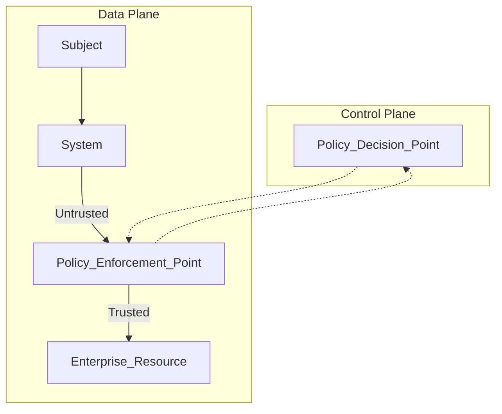

## [[Fundamentals of CIA]]

#### Confidentiality

>[!info] Disclosure attacks seek to undermine confidentiality

#### Integrity

>[!info] Alteration attacks seek to undermine integrity

#### Availability

>[!info] Denial attacks seek to undermine availability

## [[3. Identity and Access Management#^9e50d3|Identification, authentication and authorization]]
IAM should work both on-premises and on cloud environments

Examples in the real world:
- Identification: **username**
- Authentication: **password** (Systems use digital certificates to authenticate themselves to people and each other)
- Authorization: **access control lists (ACL)**

#### Accounting
Tracks user activity

##### AAA provides centralized authentication
## [[Security Controls]]
Procedures and mechanisms that an organization puts in place to manage security risks

Security controls keep your **risk profile** in line with your **risk appetite**
*Defense in depth:* multiple controls for one objective 

We categorize controls by their purpose or mechanism of action

## Gap Analysis
Important strategic planning tool. Helps develop a road map for remediation
You examine the current state of you information security program against your desired state
Gaps: controls on the desired state that are missing or fall short on you current state

**DESIRED STATE:**
- Policy
- HIPAA
- GDPR
- PCI DSS

**CURRENT STATE:**
- Security assessment

## Zero Trust
Shifting away from perimeter focus
##### Zero-Trust Network Access (ZTNA)

^da79ea

Zero trust applies least privilege to network access
Zero Trust relies on strong authentication and identity management practices instead of network-focused approach
Different network planes:
1. **Control Plane**: makes network policy decisions
2. **Data Plane**: enforces network policy decisions

###### Zero-Trust Capabilities
- Adaptive identity
- Threat scope reduction
- Policy-driven access control
- Implicit trust zones

###### Zero-Trust Components

**Policy Enforcement Point** or PEP does not make decisions, only enforces them
The decisions are made up in the control plane by the **Policy Decision Point**
The Policy Decision Point is composed of:
- *Policy Engine*, which makes the decision to grant or deny access
- *Policy Administrator*, which sends configuration commands to the **policy enforcement point** telling it how to grant or deny that access
##### Secure Access Service Edge (SASE)

^2c0cce

New approach to networking and network security
Fully integrated network with ZTNA
Cloud-based
###### SASE Components
- VPNs
- [[Software-defined networking (SDN)]]
- Zero-trust network access (ZTNA)
- Cloud access security brokers (CASBs)
- Firewall as a service (FWaaS)
- Other network security services

Provides secure access for devices regardless of their location. SASE is deployed to ensure that endpoints are secure, that data in transit is secure.

>[!important] ZTNA is a **medium-term objective**, while SASE is a **long-term goal**

## Physical Access Control
Create a secure perimeter

- **Locks**: restrict entry through portals
	*Preset locks*: use physical keys. Lock is preset to open for the correct key
	*Cipher locks*: require the user to enter the correct combination.
	*Biometric locks*: use a physical characteristic of a person to permit access
	*Card reader locks*: require that the user present a magnetic stripe or proximity access card
- **Two doors**: avoid tailgating
- **Facility Monitoring**
	*Motion sensors*
	*Noise sensors*
	*Infrared sensors*: works well in poorly lit areas
	*Pressure sensors*
	*Microwave sensors*
	*Ultrasonic sensors*
- **Video surveillance**: act as both deterrent and detective controls
- **Fences**: prevent physical intrusions on foot or by vehicle
- **Cages**: may be used to separate equipment in data centers
- **Bollards**: prevent vehicles from entering areas restricted to pedestrians
- **Proper Lighting**: increases the likelihood of intruder detection
- **Signs**
- **Industrial camouflage**: hide sensitive facilities in nondescript locations
- **Drones and UAVs**

## Physical Security Personnel
Security guards play a crucial role in physical security
Receptionists may act as security guards
A menacing look is sometimes desirable
Robot sentries may replace human security patrols

##### Two-Person Integrity
Two people must enter sensitive areas together. It **deters** theft
##### Two-Person Control
Two people must jointly approve sensitive actions

## [[Deception Technologies]]
Fool intruders

## Change Management

*Business processes impacting security operation*
Plans, implements, and monitors changes to protect organizations from unforeseen consequences
Changes should follow a **well-defined approval process**
Change **ownership** should be clearly defined
Identify and engage **stakeholders**
Conduct **impact analysis**
Test changes and review **test results**: minimizes risks
⚠ Important to have a **back-out plan** ready to go in the event of issues
Deploy changes during planned **maintenance windows**: minimize disruptions to normal business operations

>[!info] SOP
>**S**tandard **O**perating **P**rocedures: adhere to standard operating procedures. They outline the best practices, guidelines and steps to be followed when planning, implementing and monitoring changes. Reduces errors and increases efficiency

^40756b

*Technical Implications*:
- Allow lists/deny lists
- Restricted activities
- Downtime
- Service/Application restarts
- Legacy applications
- Dependencies

*Version Control* provides traceability
*Update documentation*: diagrams, policies, procedures, after changes