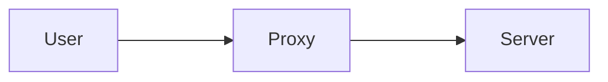

Intermediary
Connect to a website on user's behalf

## Benefits

- Anonymization
- Performance boosting (caching previously visited websites)
- Content filtering
## Forward Proxy
Work on behalf of clients

## Reverse Proxy
Work on behalf of servers

## Transparent Proxies
Work without the client's or server's knowledge
- Can cause issues on the network
- Does not work well with TLS encrypted communications

>[!important] Proxies can handle many applications, not just web traffic