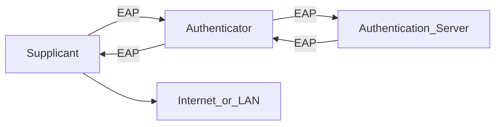

### see [[Cyberminds Academy/Week 3/Computer Networks and Network Security/Network Access Control, Endpoint Detection and Response/Network Access Control (NAC)|Network Access Control (NAC)]]

> Intercepts network traffic coming from unknown devices and verifies that the **system** and **user** are **authorized** before allowing further communication

*Uses IEEE 802.1x authentication*

The device that wishes to connect must be running a special piece of software called a **Supplicant**.
- Supplicant is responsible for performing all NAC-related tasks on behalf of the user and system
- The **authenticator** is the switch (in wired communications) or wireless controller (in wireless communications) that the device connects to. It receives credentials from the end user
- The **authentication server** is a centralized server that performs authentications for all of the authenticators on the network
## NAC Roles

- User and device authentication
- Role-based access
- Posture checking
### Role-Based Access
- Authentication server provides additional user information
- Authenticator places user on a role-appropiate network based upon that information

Different VLANs assignments

### NAC Posture Checking
a.k.a **Health Checking**
- Check devices connecting to the network comply with the organization's security policy before granting access
- Verify antivirus software presence
- Validate current signatures
- Verify proper firewall configuration
- Verify presence of security patches
=> Devices failing posture checks go into a *Quarantine VLAN*

## NAC Implementations
- Agent based => installed on the device
- Agentless
- In-band => NAC involved in both making and enforcing the access control decision
- Out of band => NAC makes the enforcement decisions, but it's left to the network switch, wireless access point, or other network component to enfroce that decision.