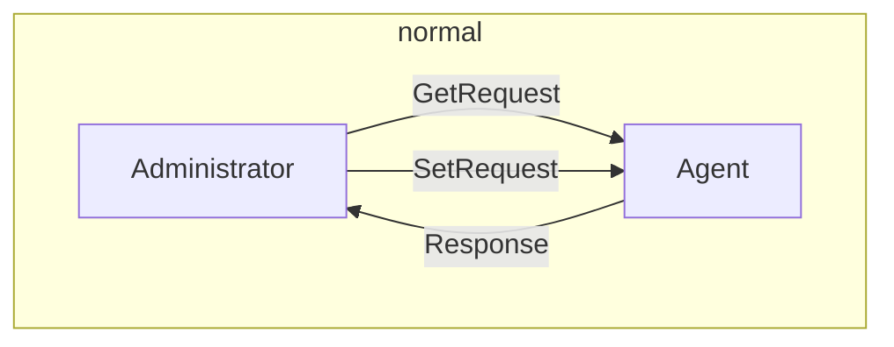
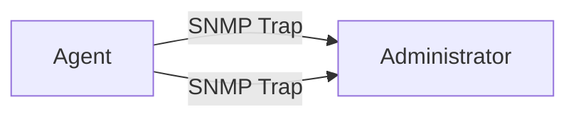

*Simple Network Management Protocol, SNMP*

Automate routine network monitoring anad management tasks
**SNMPv3**. Earlier versions have critical security flaws (e.g. sending passwords in clear text)
## Components

- *Agent*: piece of software that runs on the managed device and allows to communicate with the SNMP service
- *Network Management System*: communicates with all agents
SetRequest to tell the agent to set a specific configuration on the device

Managed devices may also initiate comunication with Network Management System when they have unusual or urgent news to report

