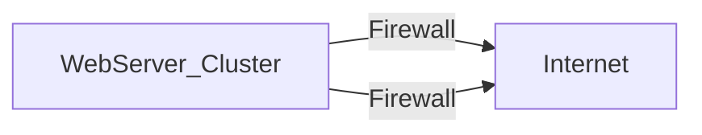

**Redundancy protects against the failure of a single component**
- Identify and removes SPOFs
- Redundancy addresses SPOFs
SPOF analysis continues until the cost of addressing risks outweighs the benefit

Other IT Contingency Scenarios:
- Bankruptcy
- Insufficient storage
- Perform succession planning for staff

---
# High Availability

Uses multiple systems to protect against service failure => **Redundancy**

>[!warning] Not the same as load balancing
# Fault Tolerance

Makes a single system resilient against technical failure

**Subject to failure**:
- Power supply
- Storage
- Network
**Fault Tolerance controls**:
- Power Supplies
	Dual Power Supply 
	Multiple Power Sources:
		*UPSs (Uninterruptible Power Supplies)* => supply battery power to devices during **brief** disruptions
		*Generators* => supply power during longer outages
		*Managed PDUs (Power Distribution Units)* => provide power cleaning and **management** for a rack
- Storage
	*Redundant Array of Inexpensive Disks (RAID)* 

**Disk mirroring, RAID 1**, stores the same data on two different disks:

**Disk striping with parity, RAID 5**, uses three or more disks to store data and parity information

>[!warning] *not a backup strategy, but a fault tolerant technique*

- Network
	Multiple ISPs
	NIC teaming
	Multipath networking (especiallt for storage)
- Platform Diversity: to avoid the same flaw on all systems
	Technologies
	Vendors
	Cryptography
	Multicloud => adds resilience to operations
