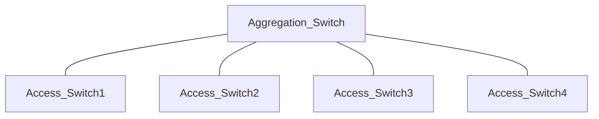

## Network Traffic Collectors

- Intrusion detection and prevention sensors
- Network taps: HW devices used to monitor and analyze network traffic on switches
- Port mirrors: creates a copy of network traffic flowing through the switch mirrored ports (SPAN source port) and send it to the monitoring port (SPAN port)

**Aggregation (or distribution) switches connect downstream access switches to each other**

>[!important] SPAN ports receive a copy of all traffic seen on a switch
### Sensors
Sensor on all networks to see traffic from each network
*Sensor on DMZ won't see traffic on intra network, and viceversa*
### Network taps

=> SPAN ports on switches receive a copy of all traffic that crosses the switch

### Port mirrors
Allows the monitoring of traffic on a single switchport
=> Duplicates the traffic

## Security Information and Event Management (SIEM)

- Gather information using **collectors**
- Analyze information with a centralized **aggregation** and **correlation** **engine**
- Place **collectors** **near the systems** generating records
- Place the **correlation engine in a secure location**

=> **Proxy servers and content filters typically belong in the DMZ**

## VPN Concentrators

HW devices used to aggregate inbound network connections from employees
- Aggregate remote user connections
- Often reside in their own VLAN, where access controls may restrict remote user activity
- Sophisticated designs may use multiple VLANs for different user roles

## SSL Accelerators
Handle the difficult cryptographic work of setting up TLS connections

## Load balancers
Distribute connection requests among multiple servers

=> **SSL accelerators and load balancers belong in the DMZ**

## DDoS Mitiagation Tools
Belong as close to the internet as possible

=> Purchasing DDoS mitigation services from your ISP is an ideal approach