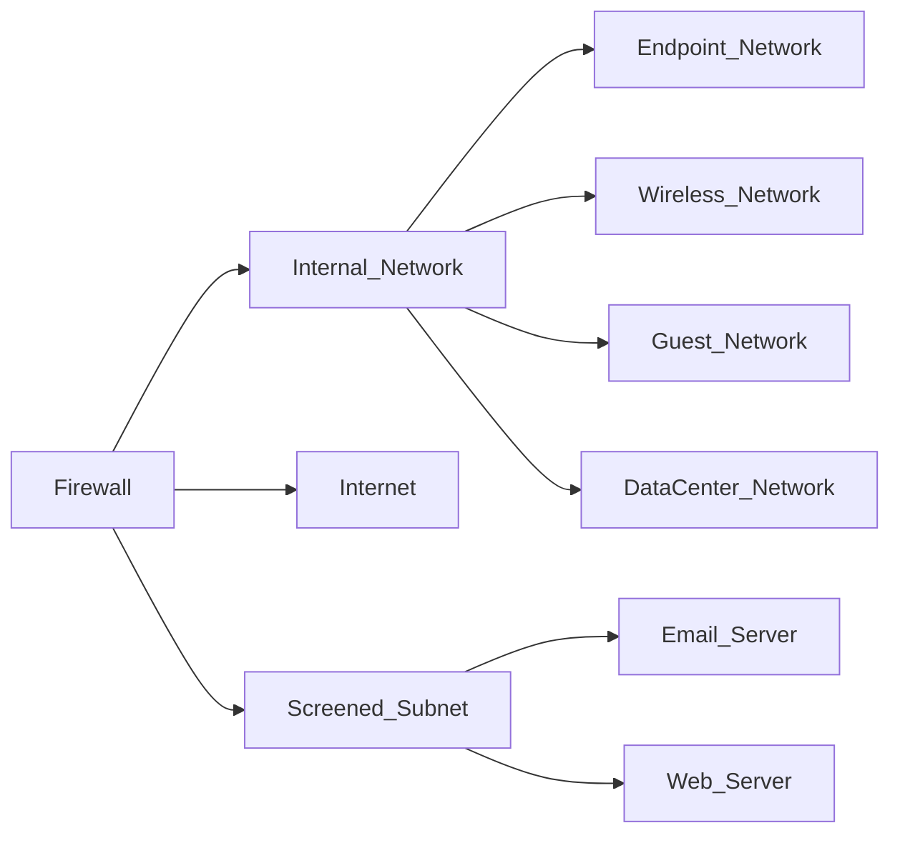

Firewalls segment networks into security zones to protect systems of differing secuirty levels
# Network Border Firewall

Connect 3 zones:
- **Internet Zone**
- **Intranet Zone**
- **Screened Subnet Zone** or **[[Segmentation#^54c2b3|DMZ]]**
	Isolates those systems due to their higher risk of compromise
	Protect internal network

## Zero Trust

System gains no trust based solely on network location

## Types of Networks

### Extranet
Intranet segment extended to business partners

### Honeynet
Decoy network designed to attract attackers

### Ad Hoc Network
Temporary network that may bypass security controls

> [!important] Segmentation
> Segmenting networks reduces the number of systems that attackers can reach from a single compromised device
> Firewalls reduce the **attack surface**

## Type of Traffic in a Network

### East-West Traffic
Network traffic between systems located in the data center

### North-South Traffic
Network traffic between systems in the data center and systems on the internet (crosses between security zones)