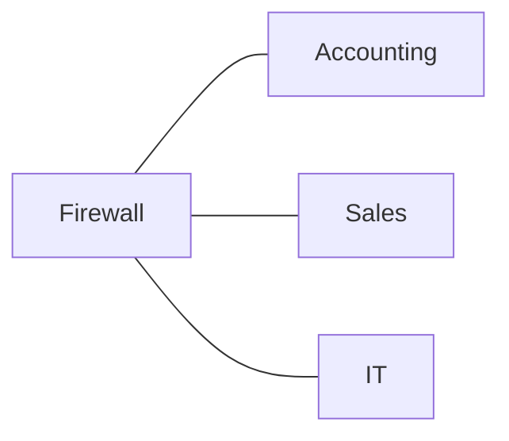
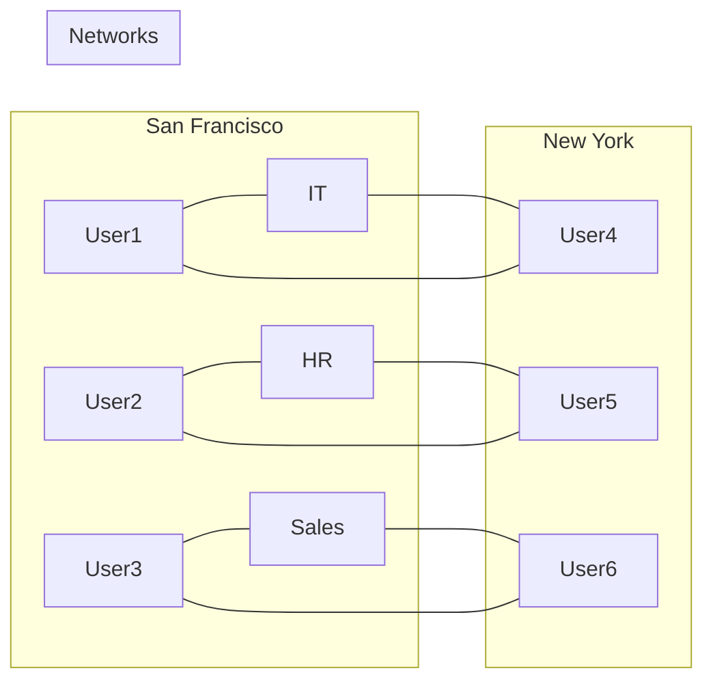

# VLAN

Virtual LANs separate systems on a network into logical groups based upon function, regardless of physical location.
Switches carry VLANs on a network (Layer 2: Data Link), without requiring routers of FWs

## Typical Network Diagram

## Network Border Firewall

=> VLANs extend the broadcast domain
=> *Users on the same VLAN will be able to contact each other as if they were connected to the same switch*

## Configuring VLANs

- Enable **VLAN trunking** to allow switches in different locations on the network to carry the same VLAN
- Assign switch ports to VLANs
