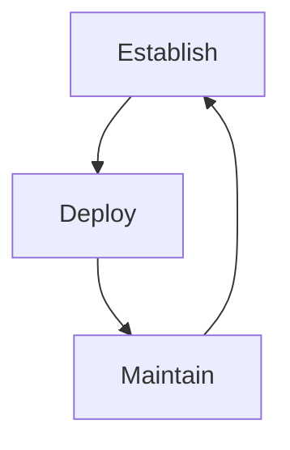
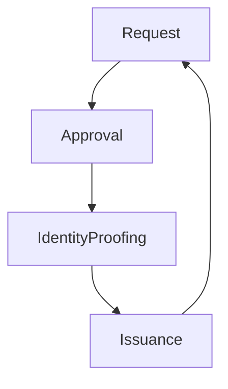

# 1. Data Security Controls
#### 1.1. [[5. Security Baselines and Standards#^4c41e2|Security baselines]]

#### 1.2. [[5. Security Baselines and Standards#^c5d409|Leveraging industry standards]]

Industry standards provide an excellent **starting point** for securing systems
Sources:
- Vendors
- Independent organizations (CIS Benchmarks)

# [[2. Host Security]]
# 3. Configuration Enforcement

#### 3.1. [[Security Management and Oversight#^727e23|Change Management]]
##### RFC (Request for Change)
- Description of the change
- Expected impact
- Risk assessment
- Rollback plan
- Identity of those involved
- Proposed schedule
- Affected configuration items
⚠ Must be approved by authorities

#### 3.2. Configuration Management
Tracks specific device settings
##### Baselines
Provide a configuration snapshot (compare baselines to approved RFC)
##### Versioning
**9.**                      *1.*                        1
**Major**     *Major update*     Minor update
**Version
of software**

#### 3.3. Physical Asset Management
Assign devices to a specific user.
Add permanent hardware asset tag to devices (IT staff or clerk) to make remote monitoring and inventory management possible
- Device Enumeration probes the network looking for devices that are not actively managed
- Media Management
#### 3.4. [[Security Management and Oversight#^d14024|Disposal and decomissioning]]

##### see [[1. Cloud Infrastructure#^5e136d|Data sanitization]]

# 4. [[Mobile Device Security]]

# 5. [[Wireless Networking]]

# 6. [[5. Software Quality Assurance|Code Security]]

# 7. Threat Intelligence

Allows teams to stay up-to-date on current risks.
Set of activities that an organization undertakes to educate itself about changes in the cybersecurity threat landscape and adapt security controls based on that information

Sources:
- *Open-Source Intelligence*
- *Email Address Harvesting*: searches for valid addresses

- **Timeliness**: how promptly is threat intelligence delivered?
- **Accuracy**: is the data correct?
- **Reliability**: is the provider consistent?

##### Intelligence sharing
- Incident responsse
- Vulnerability management
- Risk Management
- Security engineering
- Detection and monitoring
=> **ISACs** (*Information Sharing and Analysis Centers*): bring together cybersecurity teams to help share industry specific security in a confidential manner. Safe way for competitors to cooperate
Non-profit organization

#### [[Detection#^919af8|Threat Hunting]]
Threat hunting is an organized, systematic approach to **seeking out indicators of compromise** on networks using expertise and analytic techniques
- Indicators of compromise:
	Unusual binary files
	Unexpected processess ir resource consumption
	Deviations in network traffic
	Unexplained log entries
# 8. [[Vulnerability Scanning|Vulnerability Management]]

#### [[Vulnerability Management]]

#### Scan Perspective
The scanner location affects the scan results

![[image-1 2.png]]

Types of scanner:
- **Agent-based Scanning**: software installation on each target device
- **Credentialed Scanning**: Uses passwords to log in to systems
	Non-credentialed scanning is faster and can be done by automated tools

# 9. [[Audits#^b0c66d|Penetration Testing and Exercises]]

##### See [[7. Threat and Vulnerability Management#^6fa981|Penetration Testing]]

When a zero-day vulnerability is found:
=> **Responsible Disclosure**
Share newly discovered vulnerabilities with the vendor first, providing them with a *deadline* after which the vulnerability will be *publicly disclosed*

=> **Bug Bounty**
Open security testing
*Vendor offer both self-managed and full-managed bounty programs*

# 10. Security Alerting, Monitoring, and Automation

- Network or [[Network monitoring#^55a736|NetFlow]]
- DNS
- System
- Application
- Authentication
- VoIP
- Dump files
- Vulnerability scans
##### Syslog
=> provides logging standard
- Header (timestamp, source address)
- Facility (0-23): 0 kernel, 1 user, 2 email
- Severity
- Message

![[Cyberminds Academy/COMP TIA Security+/Domain_4-Security_Operations/attachments/image-1.png]]

Linux supports syslog natively

**SYSLOG VERSIONS**
- Syslog: original standard
- syslog-ng: added security and delivery enhancements in 1998
- Rsyslog: added further enhancements in 2004

##### journalct
Uses binary files, while syslog uses txt file format

##### NXLog
Centralizes the management of disparate logs

#### [[Data Event Auditability#^46db03|SIEM]]
#### [[Cyberminds Academy/Week 1/Introduction to Cybersecurity Tools & Cyber Attacks/Module 3/Cybersecurity Controls/Network Security|SOAR]]

=> **Playbooks** (for IR)
Process-focused responses to security events, including both human and automated actions
=> **Runbooks** 
Automated responses to security events that execute immediately and aid human investigations

#### Monitoring activities

##### Quarantine
Isolates a potentially infected system form the rest of the network
##### Alert Tuning
Adjust the alerting system to reduce the rate of false positive alerts

#### [[User (and Entity) Behavior Analysis (UBA-UEBA)]]

#### Automation and Orchestration

##### Scripts
- User provisioning
- Resource provisioning
- Guadrails
- Security groups
- Ticket creation
- Escalation
- Enabling/disabling services and access
- Continuous integration and testing
- Integrations and APIs

# 11. [[Transport Encryption|Secure Protocols]]

#### 11.1. [[TLS and SSL]]
#### 11.2. [[Transport Encryption#^ff0973|IPsec]]
More in [[VPNs and VPN concentrators#^5774fc|IPsec]], [[VPN Protocols#^42ce52|IPsec/L2TP]]
#### 11.3. [[Transport Encryption#^0fb9db|Securing common protocols]]
#### 11.3. [[Email Security]]

# 12. Identification

#### 12.1. [[3. Identity and Access Management#^9e50d3|AAA]]

##### Identification
- Usernames (employer ID)
- Access cards (may perform both identification and authentication)
	-Magnetic Stripe Cards: not secure
	-Smart Cards
*Active cards*: contain batteries and transmitter (can be read form miles away) and must be replaced periodically
*Passive cards*: e.g. Card Readers and Proximity Cards

##### Registration Process

Separation of duties is important in this process

# 13. [[3. Identity and Access Management|Authentication]]

# 14. Authorization

#### Authorization Principles
##### Least Privilege
Minimum set of principles necessary to carry out their job functions
##### Separation of Duties
Performing any critical business function should require involvement of two or more individuals
##### Privilege Creep
User accumulates excess permissions after shifting job responsabilities
=> Prevent by doing **account reviews**

#### [[Authorization|Access Controls]]

# 15. [[8. Incident Management|Incident Response]]

NIST 
![[Cyberminds Academy/COMP TIA Security+/Domain_4-Security_Operations/attachments/image-1 1.png]]

# 16. [[9. Investigations and Forensics|Digital Forensics]]
#### [[Information Management#^f6cf0a|eDiscovery]]