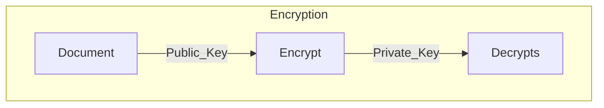
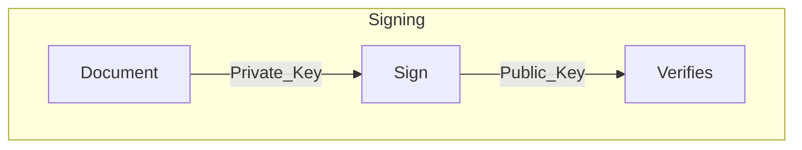

>[!info]
>Anything encrypted with one key from a pair can be decrypted with the other key from the **same pair**

Less cryptographic keys

```mermaid
flowchart TD
subgraph Encryption
Document --Public_Key -->Encrypt --Private_Key --> Decrypts
end
```

```mermaid
flowchart TD
subgraph Signing
Document --Private_Key -->Sign --Public_Key --> Verifies
end
```
