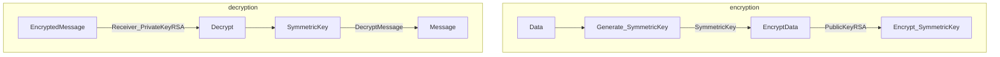

### *Pretty Good Privacy*
- Phil Zimmerman
- OpenPGP is commonly used

> [!info]
> **Framework to use other encryption algorithms**
> Symmetric + Asymmetric encryption

### *GnuPG*
Open-source implementation of PGP
