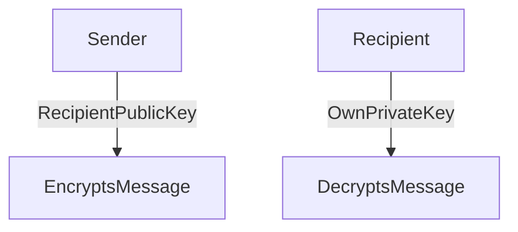

- Ron Rivest
- Adi Shimer
- Leonard Adleman

>[!info]
>- Two very large prime numbers
>- Distribute public key freely
>- Keep the private key secret
>- Variable length key: **1024 - 4096 bits**
>- Considered secure

👎RSA is slow

--> **Commonly** **used to exchange symmetric keys**
--> RSA patent is expired (since 2000)