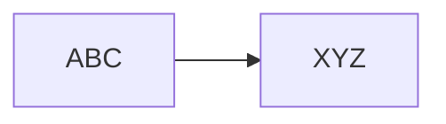
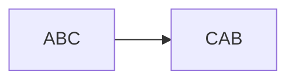

### Code

A system that substitutes one word or phrase for another
Seemingly meaningless phrases may convey significant messages

### Cipher

Systems that use mathematical algorithms to encrypt/decrypt.

- **Stream Cipher**
	Operate on one character, or bit, of a message at a time

- **Block Cipher**
	Operate on large segments of the message at the same time

#### Substitution Ciphers
Change the characters in a message
--> a.k.a Rotation Ciphers

#### Transposition Ciphers
Rearrange the characters in a message

