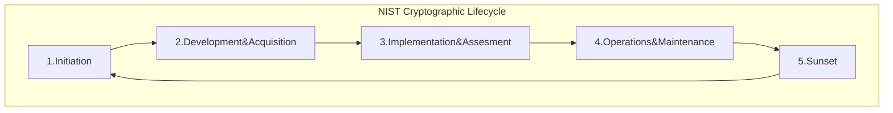

```mermaid
flowchart TD
subgraph NIST Cryptographic Lifecycle
	1.Initiation --> 2.Development&Acquisition
	2.Development&Acquisition --> 3.Implementation&Assesment
	3.Implementation&Assesment --> 4.Operations&Maintenance
	4.Operations&Maintenance --> 5.Sunset
	5.Sunset --> 1.Initiation
end
```
--> Sunset: get rid of the cryptographic algorithm, including the keys used