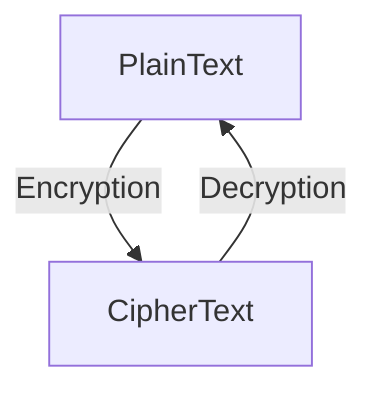
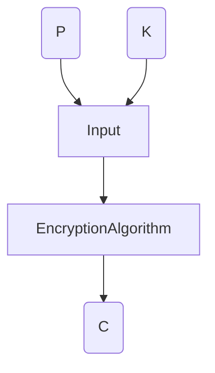

```mermaid
flowchart TD
	PlainText --Encryption --> CipherText
	CipherText --Decryption --> PlainText
```

>[!info]
>Cryptography is the use of mathematical algorithms to transform information into an encrypted form that is not readable by unauthorized individuals

```mermaid
flowchart TD
	PlainText(P) --> Input
	EncryptionKey(K) --> Input
	Input --> EncryptionAlgorithm
	EncryptionAlgorithm --> Ciphertext(C)
```
