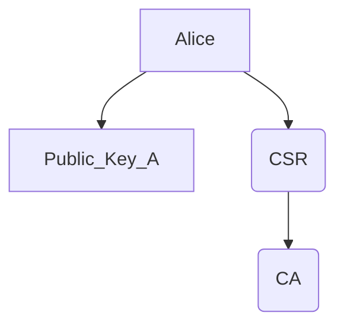
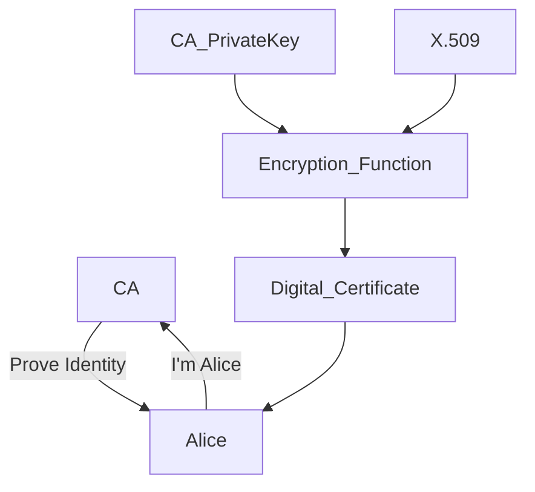
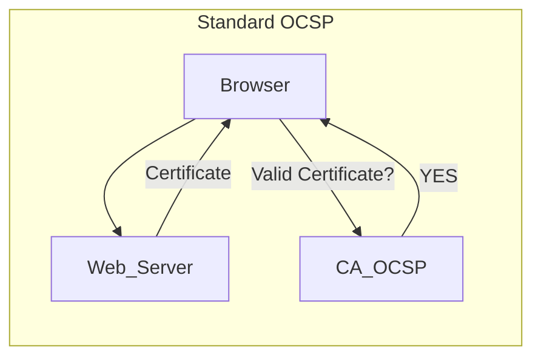
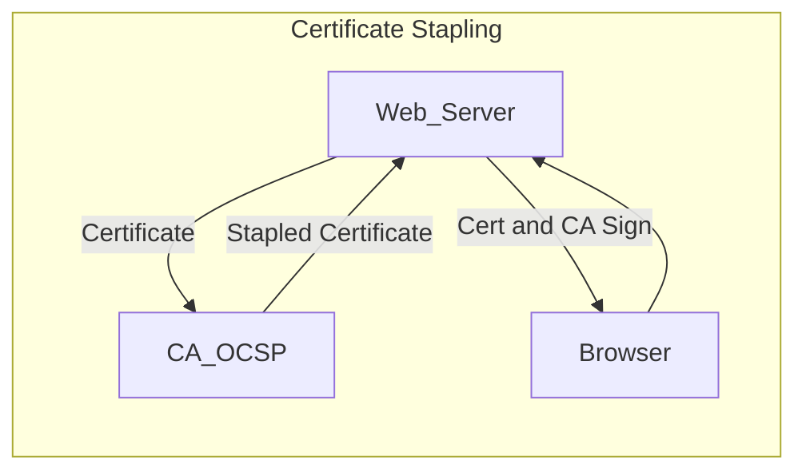
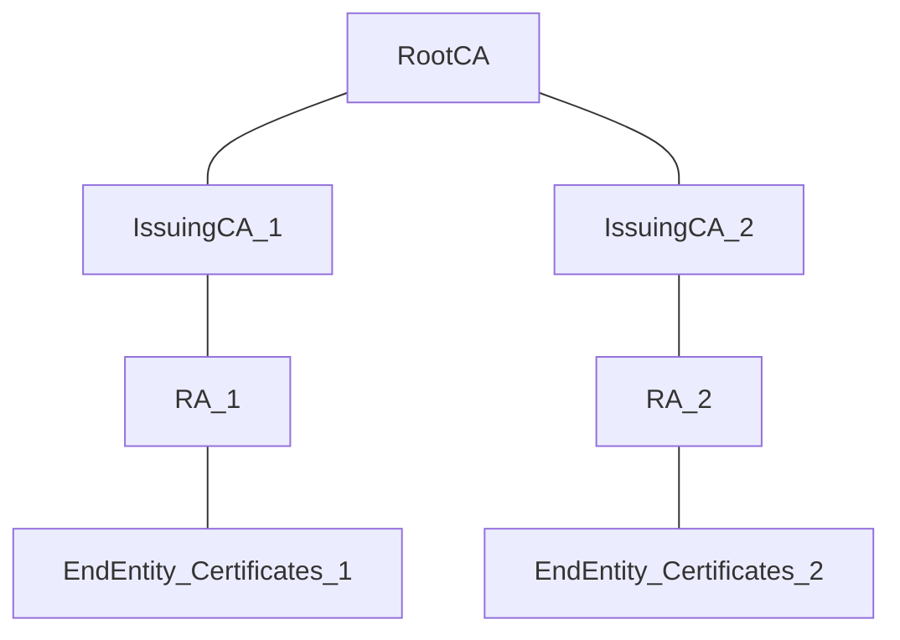

--> Useful for the creation of digital signatures
One-way functions that transform a variable length input into a unique, fixed-length output

### Characteristics

One-way functions can't be reversed
- Variable length input --> Fixed length outputs
- No two inputs to a hash function should produce the same output

### It may fail

- If they are reversible
- Not collision resistent (two inputs -> same output)

## Message Digest 5 (MD5)

- Ron Rivest
- *Message digest = Hash*
- MD5 produces 128-bit hashes
- ⚠ no longer secured
## SHA-1
- NIST
- SHA-1 produces 160-bit value
- ⚠ not secured

## SHA-2
- NIST
- Family of six hash functions
- Output of 224, 256, 384 and 512 bits
- Similar approach to MD5 and SHA-1

## SHA-3
- NIST
- Designed to replace SHA-2
- Different hash generation approach than SHA-2
- Produces hashes of user-selected fixed-length

## RIPEMD
- Alternative to government-sponsored hash functions
- Produces 128 (⚠not secured),160, 256, and 320-bit hashes

# HMAC

*Hash-based Message Authentication Code*

- **Symmetric cryptography + hashing**
- Provides Authentication + Integrity

# Digital Signatures and Certificates

- **Asymmetric cryptography + hashing**

## Digital  Signatures

- Asymmetric cryptography
- Achieve:
1. **integrity**: The owner of the public key is the person who signed the message
2. **authentication**: The message was not altered after being signed
3. **non-repudiation**: The recipient can prove these facts to a third-party
- Does **not** provide **confidentiality**
- Rely on collision-resistant hash functions

--> **Reverse process of asymmetric encryption**

Use private key to create digital signatures and public key to verificate

#### Digital Signature Standard: FIPS 186-4

##### Approved DSS Algorithms

- *Digital Signature Algorithm (DSA): related to ElGamal algorithm*

- *Rivest-Shamir-Adelman (RSA)*: 
	Large prime numbers and factoring problem
	Direct signed of the message
	Security based on key length
	Large keys take long time to generate
	
**🗒 + 🔑(Private Key) --> 📝(Signed) + 🔑 (Public Key) --> 🗒✅** 

- *Elliptic Curve Digital Signature Algorithm (ECDSA)*: 
	Elliptic Curves over finite fields
	Only the hash of the data is signed
	Smaller keys than RSA are needed for the same level of security
	Faster key generation (especially on embedded systems)
	
**🗒 --> Hash(🗒) + 🔑(Private Key) --> 📝(signed) --> Hash(🗒) + 🔑 (Public Key) --> 🗒✅**

## Certificates
Use the concept of digital signature

🗒 Meta Data
🔑 Public Key
📝 Signature (from CA)

In the verification process, it is used the public key of the CA
#### Creation of Digital Certificates

- Digital certificates follow the X.509 standard

Certificate Signing Request (CSR) contains public key and private information of the requester
This certificate is sent to the Certificate Authority (CA) or Register Authority (RA)

In CLI:
CSR --> `req -new -newkey rsa:2048`
Personal information is requested
Copy and paste CSR to a CA so, they can sign it
#### Revoking Certificates

--> **Certification Revocation List (CRL)**
Includes serial numbers of revoked certificates
Not efficient

--> **Online Certificate Status Protocol (OCSP)**
More relient
Provides real-time certificate status verification
Modern browsers use OCSP (except Google)
👎Significant burden on the OCSP servers operated by certificate authorities (CAs)
- **Certificate Stapling**
	Reduces the CA's burden
	Reuse of stapled certificate (validity for 24 h)

#### Certificate Authorities

CAs charge fees for their services when creating a new certificate

--> **Self-Signed Certificates**
Issued by an internal CA
Not trusted  by the external world, only for inside the entity

--> **Certificate Chaining for intermediate CAs**
CAs that are trusted by a global CA --> Chain of Trust established (the whole chain of certificates must be checked)
- Allows use of *Offline CAs* --> protect sensitive root keys

#### Certificate Subjects
Owner of the public key
Certificate Object Identifiers (OIDs) --> IP addresses that identify components

e.g.
- **Servers:** web, SSH, file, email...
- **Devices:** SANs (*Store Area Networks*), routers, VPNs, access points...
- **Individuals:** name, emails addresses...
- **Developers:** code signing

##### Certificate Pinning
Ties a certificate to a subject for a period of time

#### Certificate Types

##### Root Certificates
Root of Trust
- Protect CA private keys
- Only self-signed certificates 

##### Wildcard Certificates
Cover an entire domain
- Only match one level deep
- Cover subdomains

###### Degree of Trust

**Domain Validation**: verifies domain ownership
**Organizational Validation:** verifies business name
**Extended Validation**: Requires extensive investigation

#### Certificate Formats

##### Distinguished Encoding Rules (DER)

- **Binary** format
- Use DER, **CRT**, and CER file extensions

##### Private Enhanced Mail (PEM)

- **ASCII text** equivalents of DER certificates
- Convert with OpenSSL
- PEM or **CRT** extensions

>[!important]
>CRT can be for DER and PEM certificates, so there is no way of knowing which is it, unless wee look into the certificate

##### Personal Information Exchange (PFX)

- **Binary** format
- Commonly used for Windows
- PFX (Windows) and P12 (Linux, Windows)  file extensions
- **PKCS#12**
##### P7B

- ASCII test equivalent of PFX certificates
- Commonly on Windows
- P7B file extensions
