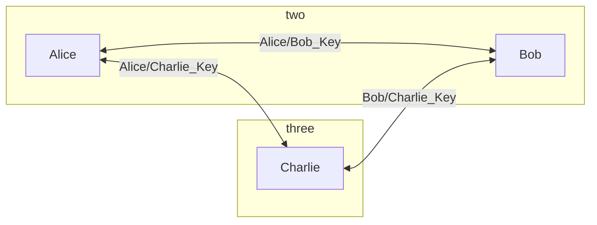

```mermaid
flowchart LR
subgraph two
	Alice <--Alice/Bob_Key --> Bob
end
subgraph three
	Alice <--Alice/Charlie_Key --> Charlie
	Charlie <--Bob/Charlie_Key --> Bob
end
```

$$
N_{keys} = \frac{n(n-1)}{2}
$$
**Symmetric Encryption: requires a lot of keys**

