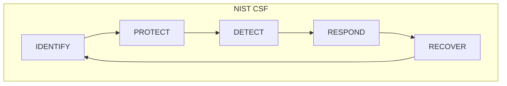
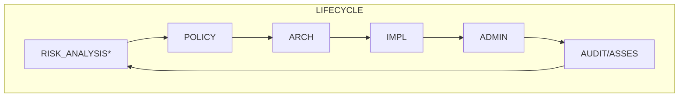

```mermaid
flowchart TD
subgraph NIST CSF
	IDENTIFY --> PROTECT
	PROTECT --> DETECT
	DETECT --> RESPOND
	RESPOND --> RECOVER
	RECOVER -->  IDENTIFY
end
```

```mermaid
flowchart TD
subgraph LIFECYCLE
	RISK_ANALYSIS* --> POLICY
	POLICY --> ARCH
	ARCH --> IMPL
	IMPL --> ADMIN
	ADMIN -->  AUDIT/ASSES
	AUDIT/ASSES --> RISK_ANALYSIS*
end
```
Cybersecurity Architecure should be on the **Risk Analysis** Phase