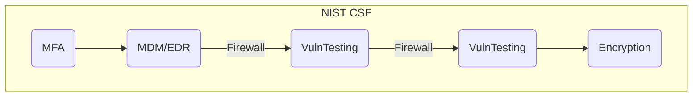

## 1. Defense in Depth

Layers security.
--> Not relying on a single point mechanism (**No single point of failure**)
--> If one fails, the system still works

## 2. Least Privilege

Grant the sufficient rights for as long they need them
- **Hardening**
	Remove unneeded services and replace IDs (e.g *admin* -> *Jeff*)
	--> Reduces the attack surface
- **Privilege Creep**
	Mantain access to everything when they received a promotio
- "**Just in case**"
	Add unneeded rights to avoid coming in the futur

*Solution*: Annual recert campaign to check the rights of the organization

## 3. Separation of duties

**No single point of control** (NO SPOC)
--> Collusion
## 4. Security by design

--> Security built-in throughout the product lifecycle
--> **Out of the Box**
--> The security begins with the developer

## 5. KISS

*Keep It Simple Stupid*

--> Too complex measures will incentivise the circumvention

Complexity ≠ Security

**Complexity is the enemy of security**
## ~~X. Security by Obscurity~~

Secrecy ≠ Security

**Principle of Kerckhoffs**: The security of a system must NOT rely on some secret knowledge. A cryptosystem must be secure, even if everything, except for the key, is public knowledge.

