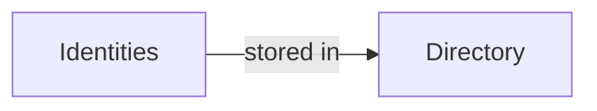
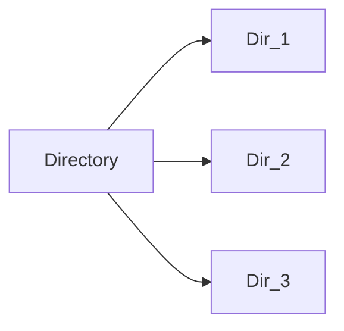
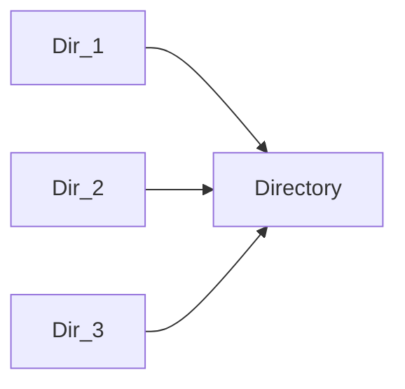
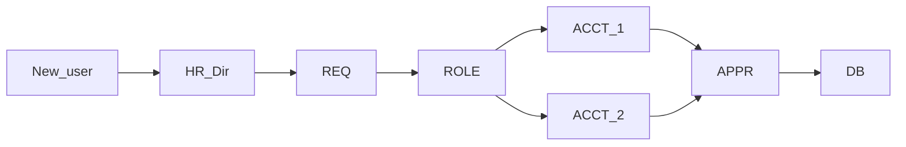
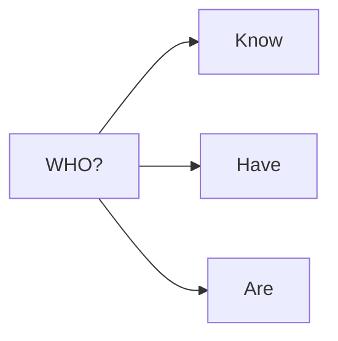
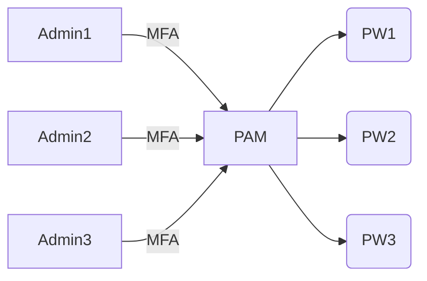

[[Cyberminds Academy/Week 1/Introduction to Cybersecurity Tools & Cyber Attacks/Module 4/Authentication and Access Control/Identity and Access Management|Identity and Access Management]]

#### Store and Sync

- [x] **DataBases**

- [x] **Schema**
Oragnization/Representation of user's data

- [x] **Protocol**
Way to talk to the Directory (**LDAP**)

---

In  the real world, the are several directories --> need to **SYNC**
##### SYNC option

--> **Virtual Directory**. One directory that acts as index

--> **Meta-Directory**. Prefetch only relevant information

### Administration

##### User cases
- New employee at HR
- Employee request more access rights
- Remove access right to recently ex-employee
- 
**Infrastructure:**

### Authentication

--> *MFA*
--> *Password-less authentication*
--> *SSO*

### Authorization

[x] **Location**
[x] **Request-Time** 
[x] **Frequency**

#### PAM (Privileged Access Management)

~~Shared accounts, same passwords~~ --> Shared account without shared passwords with **PAM**

With PAM, users still only have to remember **1 password** and they have to use **MFA**, so it garanties **no repudiation** (MFA identifies user, *a shared password can be anyone*).

### Audit

Check logs status and changes.

--> **User Behaviour Analytics (UBA)** or **User Entity Behaviour Analytics (UEBA)**

Spot anomalies in log systems with Machine Learning

#### Federation Capability

Integrate with other security/identity domains
--> **Connection**

*Notes:*
CIAM (Costumer Identity and Access Management) --> IAM in customer-facing applications
Worforce Indentity --> processes, tools and stretegies used to manage workforce