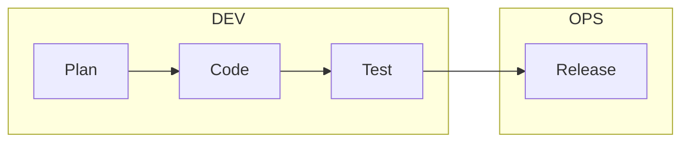
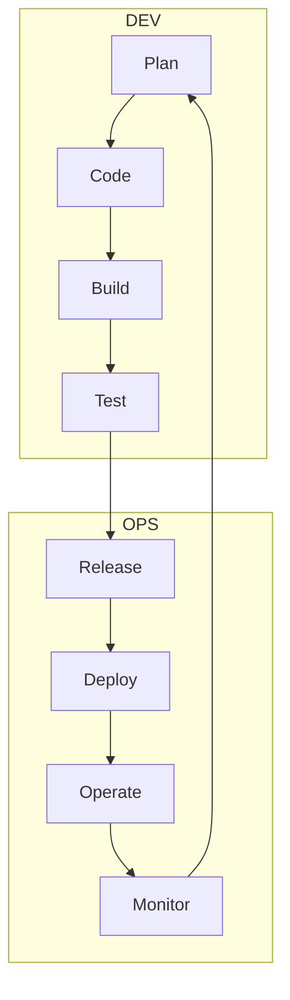

SW -> Bugs
% -> Vulns
SW -> Vulns

**Dev**eloping Phase
**Op**eration Phase -> Public Release

**TRADITIONAL APPROACH** --> *Linear*

👎Slow
👎Inflexible

**DevOps APPROACH** --> *Cyclical* ^0140b8

👎Integrated
👎Agile

--> **DevSecOps**

- Security Built-In
- Security by Design
- Collaboration
- Automation