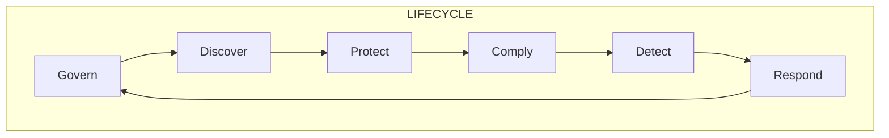

### Why? 
💰💰
#### Top 5 that reduces cost of data breaches
- AI
- DevSecOps
- IR (Incident Response)
- Cryptography
- Employee Training
### Data Security Ecosystem

#### 1. Governance
- Policy
- Classify
- Catalog
- Resilience

#### 2. Discovery
- DataBase -Structured data
- File - Unstructured data
- Network
- [[Data Loss Prevention (DLP)]]

#### 3. Protection
- Encryption (rest/in motion)
- Key management (re-encrypt)
- Access Control
- Backup
- QSC (*Quantum Safe Crypto*)

#### 4. Compliance
- Report
- Retain

#### 5. Detect
- Monitor
- UBA
- Alerts

#### 6. Respond
- Cases
- Dynamic Playbooks
- Orchestrate
- Automation