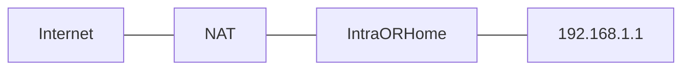
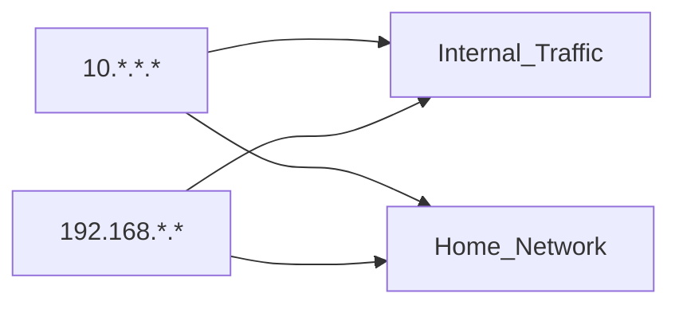
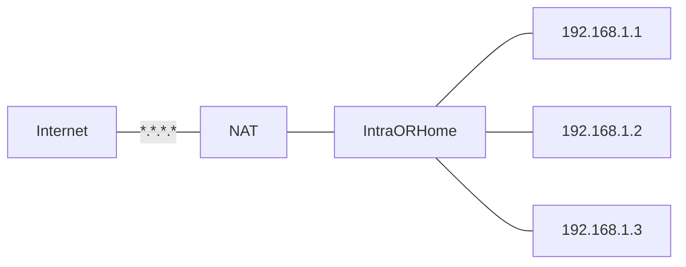

Special computer or software running on a general purpose computer or router. It controls waht data (metwrok packets) enters or leaves the network
Way to create isolation so the danger does **not spread**

##### Packet Filtering

**Header**        		   **Payload**
[ SRC   DST  PORT |/////////////////]
----- PKT FILT -----

*First Firewall*
P = 80/443

Source -> Address it's coming from. *Firewall checks if address comes from inside or outside*
Destination -> Where it should go. *Firewall checks if it is an accesible destination, i.e. WebServer but not the Database*
Port -> Type of traffic it is. 

*Second Firewall*
P = 3306 (port between webserver and database)

S = *Source must be from the WebServer, not from teh Internet*
D = *Destination can only be de Database*

##### Stateful Packet Inspection

**Header**        		   **Payload**
[ SRC   DST  PORT |/////////////////]
----------------- SPI ----------------  

Checks also the **payload**.

##### Proxy

Good MITM
✅Inspect
✅Enforce *security policy*

##### Network Address Translation

Allows to separate **Internal Traffic** (*Intra*) from **External Traffic**. NAT serves as a translator between both.

- NAT translates the internal address to a common one that the Internet can interpret. ^3d958c
- The internal addresses (`10.*.*.*` and `192.168.*.*`) are not routable accross the Internet

*Note:*

**Modem**:
- A modem (short for Modulator-Demodulator) is a hardware device that connects your local network to the Internet by converting digital signals from your device into analog signals that can travel over telephone lines, cable systems, or fiber optics and vice versa.
- Its primary role is enabling internet access.
- Acts as the bridge between your Internet Service Provider (ISP) and your local network.
- Operates at the **Physical Layer (Layer 1)** and the **Data Link Layer (Layer 2)** of the OSI model.