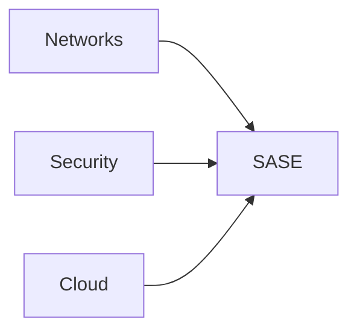

**Secure Access Service Edge**

Security and network capabilities from the cloud at the network's edge

$$
SASE = \frac{NETSEC + WAN}{CLOUD}
$$
$$
NETSEC = FW + SEC WG + DLP + ...
$$
$$
WAN -> SD-WAN
$$
$$
CLOUD -> SCALE + ELASTIC + AGILE
$$
$$
ID = AUTHN + AUTHZ
$$
