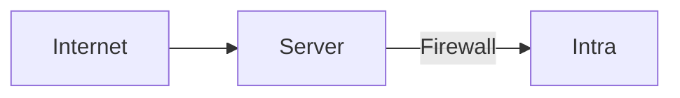
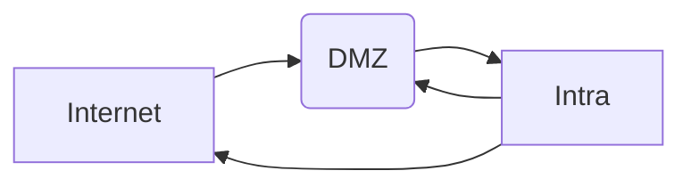
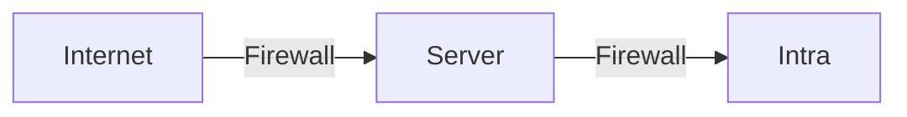
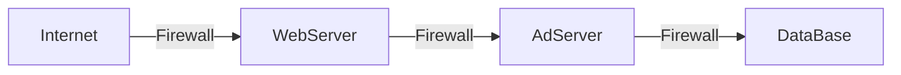

#### Bastion
⚠ Not recommended

#### Tri-Homed
Buffer that sits in between a Not-Trusted Environment (Internet) and More-Trusted Environment (Intra)

**DMZ**: Demilitarized Zone (*Semi-Trusted*) ^54c2b3

👍Scalable
👍Cheap

👎One Single Point of Failure (SPOF)
#### Basic DMZ

👍Defense in Depth
👍Scalable

👎Cost
👎Complex

#### Multi-Tiered DMZ

👍Defense in Depth
👍Granularity

👎Cost
👎Complex