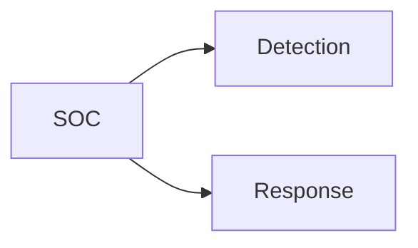
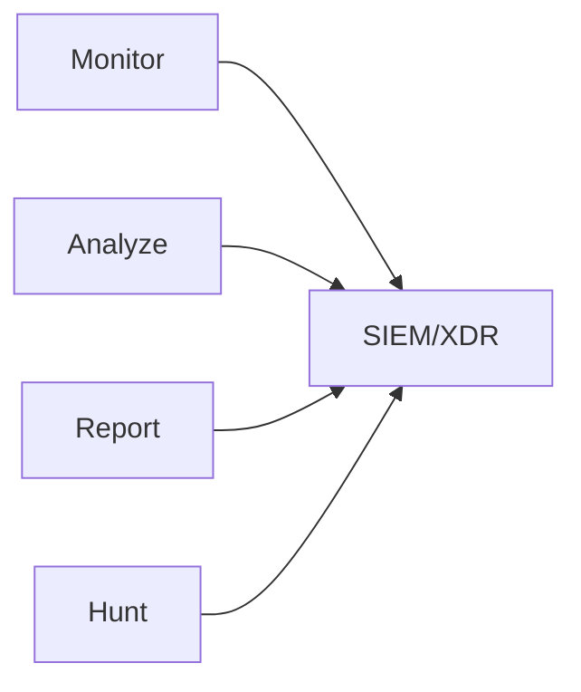
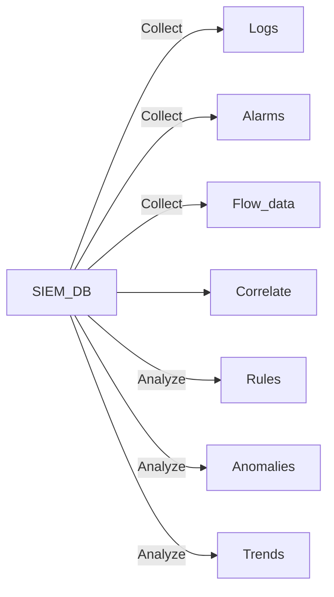

CIA Triad --> **What**
S = P + D + R --> **How?**

Security = Protect + *Detection* + [[Response]]
SOC = *Security Operations Center*
SIEM = *Security Information and Event Management*

*Note*:                                  Hunt
         Attack           <-----Aware
<--------------------------------------------------->
<---Reckon---><----**MTTI**-------><----MTTC---->

**MTTI (Mean Time to Identify)** = 200 days aprox.
**MTTC (Mean Time to Contain)** = 70 days aprox.

>[!info]
>Investigation: Reactive
  Threat Hunting: Proactive
### SIEM

Reduce footprint and enhace visibility of all the systems and create analysis

--> **Collect**
	Logs
	Alarms
	Flow data
Feed the collected data to SIEM database in order to analyze

--> **Correlate**
Get smaller, collectable information

--> **Analyze**
	Rules-Policies (IF_THEN_)
	Anomalies (AI / ML / UBA)
	Trends (Reports)

>[!info]
>SIEM dedicated to **centralized** **logs** and **network behaviour analysis**
>Log and Network Managment
>Data is stored in **databases**
### XDR

**Extended Detection and Response**
Top-Down Approach

*Endpoint Detection and Response (EDR):*
	Close to the source of the attack
	Installation of capabilities in endpoints

*Federate Response:*
	Gathers the data just in time when it is needed (it is not pre-fetched as SIEM)
	Checks only the devices that fullfill the conditions
	More efficient

> [!info]
> XDR = EDR + Federate Response

---

#### Solution: SIEM + XDR

