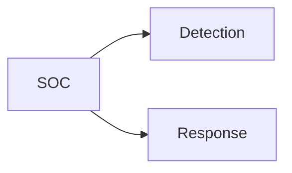
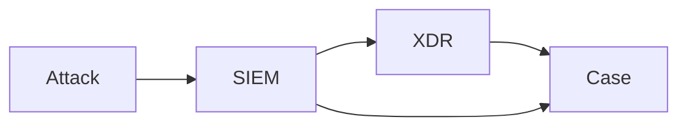

CIA Triad --> **What**
S = P + D + R --> **How?**

Security = Prevention + [[Detection]] + *Response*

**SOC**:
- Monitor
- Detect
- Respond

>         Attack               Aware
<--------------------------------------------------->
<---Reckon---><----MTTI-------><----**MTTC**---->

**MTTI (Mean Time to Identify)** = 200 days aprox.
**MTTC (Mean Time to Contain)** = 70 days aprox.
#### Basics
##### Incident Response (IR)

*Traditional*
- Manual
- Triage (prioritize)
- Remediate

*Modern* --> **SOAR** (Security Orchestration Automation and Response)
- Automation
- Orchestration

#### Cases

#### Investigate

Starts the investigation from the **case** created
**Dynamic Playbook**
#### Auto & Orch

FOAK -> *First of a Kind*
				Orch 
Human <--------------------------------> Machine
        SOAR --------->

Orchestation -> when automation is not possible (e.g. FOAK)
#### Notify

In case it was a data breach

-> Data
-> Geography
-> Regulations