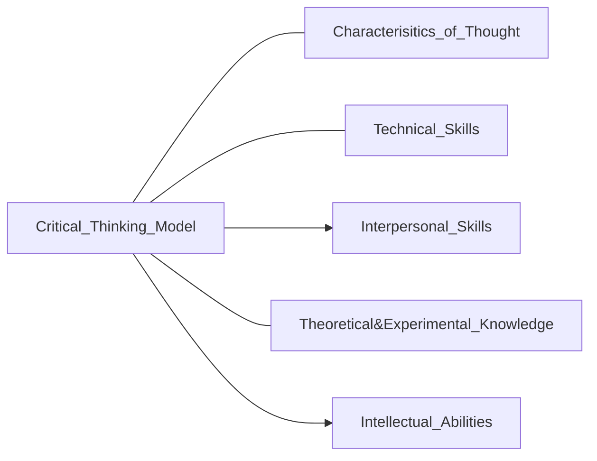
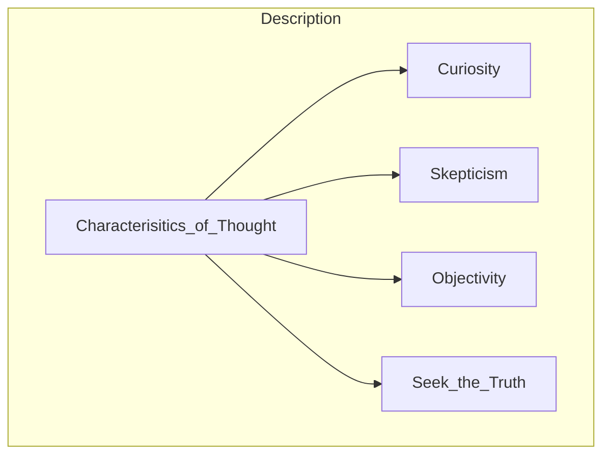
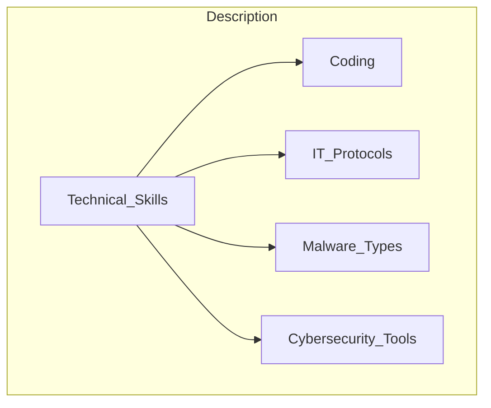
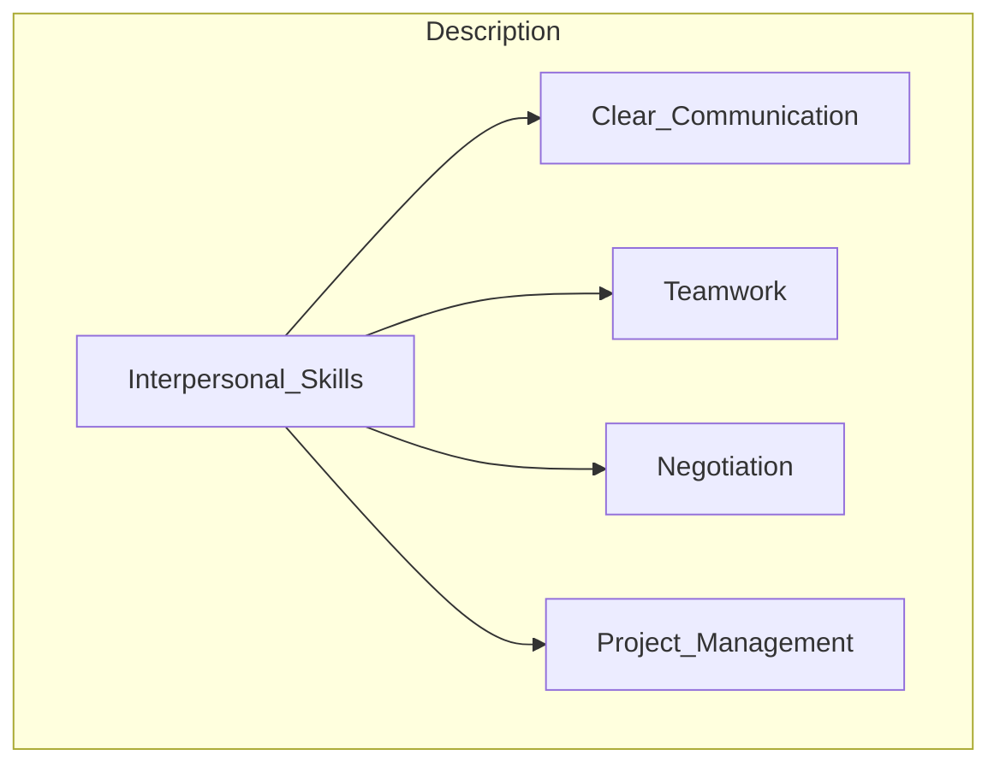
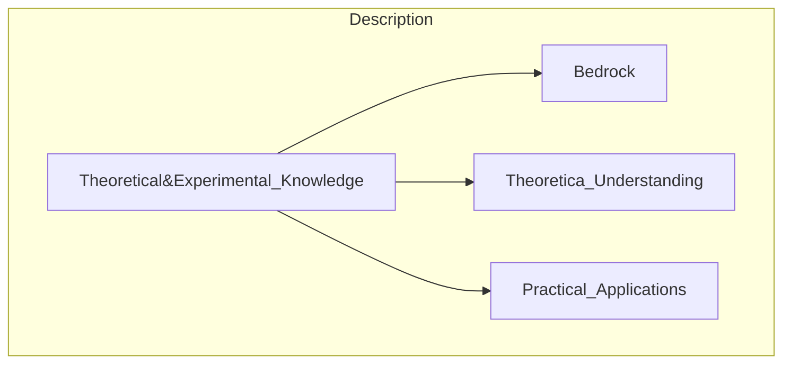
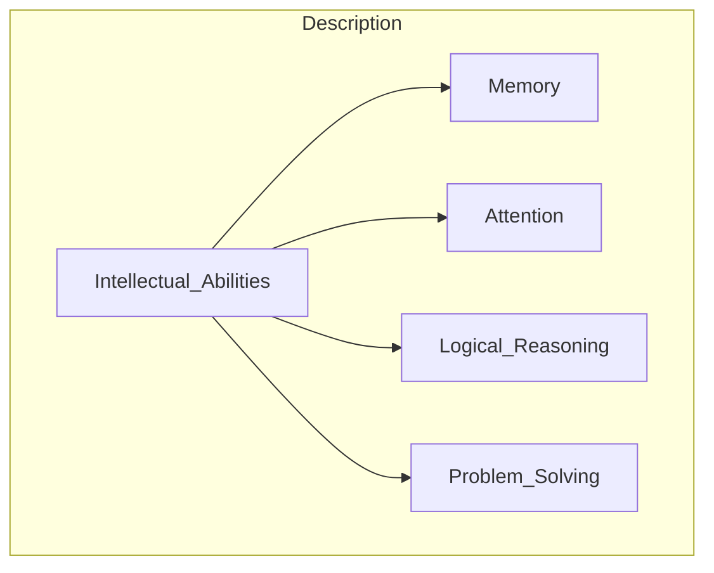

**Holistic approach**
**Robust process**
**Balanced decision-making**
**Combat cyber-threats**
**Secure digital assets**

```mermaid
flowchart LR
	Critical_Thinking_Model --- Characterisitics_of_Thought
	Critical_Thinking_Model --- Technical_Skills
	Critical_Thinking_Model --> Interpersonal_Skills
	Critical_Thinking_Model --- Theoretical&Experimental_Knowledge
	Critical_Thinking_Model -->  Intellectual_Abilities
```

	

```mermaid
flowchart TD
subgraph Description
	Characterisitics_of_Thought --> Curiosity
	Characterisitics_of_Thought --> Skepticism
	Characterisitics_of_Thought --> Objectivity
	Characterisitics_of_Thought --> Seek_the_Truth
end
```

```mermaid
flowchart TD
subgraph Description
	Technical_Skills --> Coding
	Technical_Skills --> IT_Protocols
	Technical_Skills --> Malware_Types
	Technical_Skills --> Cybersecurity_Tools
end
```

```mermaid
flowchart TD
subgraph Description
	Interpersonal_Skills --> Clear_Communication
	Interpersonal_Skills --> Teamwork
	Interpersonal_Skills --> Negotiation
	Interpersonal_Skills --> Project_Management
end
```

```mermaid
flowchart TD
subgraph Description
	Theoretical&Experimental_Knowledge --> Bedrock
	Theoretical&Experimental_Knowledge --> Theoretica_Understanding
	Theoretical&Experimental_Knowledge --> Practical_Applications
end
```

```mermaid
flowchart TD
subgraph Description
	Intellectual_Abilities --> Memory
	Intellectual_Abilities --> Attention
	Intellectual_Abilities --> Logical_Reasoning
	Intellectual_Abilities --> Problem_Solving
end
```
