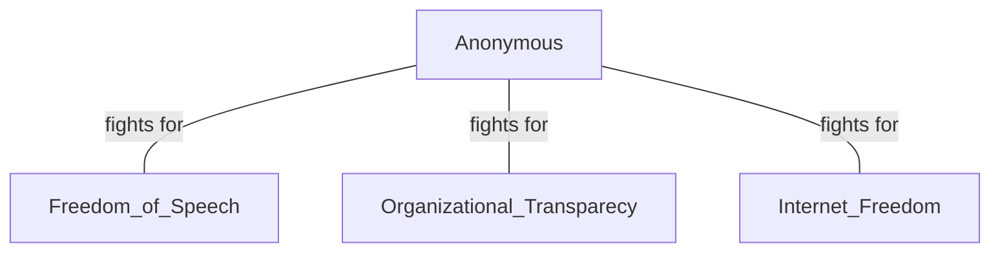

### Threat Actor

Individual or group responsible fora ctions that can harm computer systems, networks ...

##### Motivations

- Financial
- Espionage
- Political
- Disruption

#### Hacktivists

*Agenda* -> **political** or **social**
*Target* -> Systems
*Strategy* -> Website defacement or Denial of Services attacks

##### e.g. Anonymous
Distinct masks -> Guy Fox
Cyber sabotage

#### Organized crime syndicates

*Agenda* -> **financial**
*Strategy* -> Ransomware, Data theft and Identity theft
*Methodology* -> Mimic legitimate businesses

##### e.g. Lazarus (north Korean group)
- Stole 300$ in cryptocurrency in 2023
- Attacks: Sony Pictures - 2014, WannaCry - 2017

#### Nation-state actors

**Government sponsored**
*Methodology*: Cyber espionage and Cyberattacks
*Agenda*: Geopolitical interests
*Objectives*: Espionage, Intelectual Property Theft, Destabilization of other nations's infrastructure

##### e.g. Russia-Ukraine conflict
- Cyber warfare
- Cyberattacks to:
	- Spread propaganda
	- Establish dominance

#### Script kiddies

**Inexperienced individuals**
*Leverage*: Existing programs and Scripts
*Motives*: Random, Thrill, Notoriety
*Consequences*: Incarceration

##### e.g. Mafiaboy
- Distributes **DoS** attack to numerous websites

#### Insider threat actors

*Primary source*: Employees
*Target*: Organization
*Motives*: Malice, Grievance, Financial, Negligence, Oversight

##### e.g. Edward Snowden

- Critical security breach
- Classified documents leaked
-> Privacy debates about surveilance and privacy rights
-> Public and Political Impact