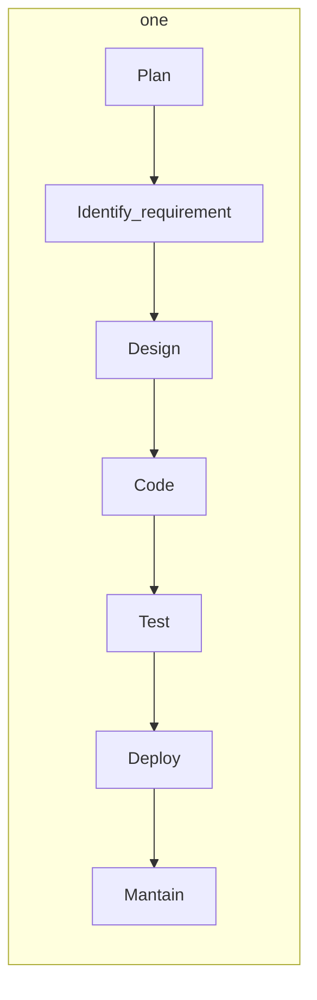

- Span the entire life cycle (**Security by Design**)
- Enhance overall security
### SDLC (Software Development LifeCycle)

-> Structures sequence of stages outlining the process of developing software

##### Secure Coding practices

**Input validation**
- Protection against SQL Injection

**Error handling**
- Enables software to deal with the issue (prevents crashing) -> predefined answers
- Avoid unknown responses

**Secure logging**
- Identify unsual activities
- Keep logs secure

**Avoid hardcoded credentials**
- Sensitive information (passwords, API keys)
- Security risk since an attacker can gain unauthorized access if they know where to look
- Store in encrypted files

**Access control**
- Prevents acces to unauthorized users

**Encryption**
- Encrypt data during storage and transit

**Software Security Testing**
- Assess and ensure security
- Evaluations that aims to identify potential security risks before deploying