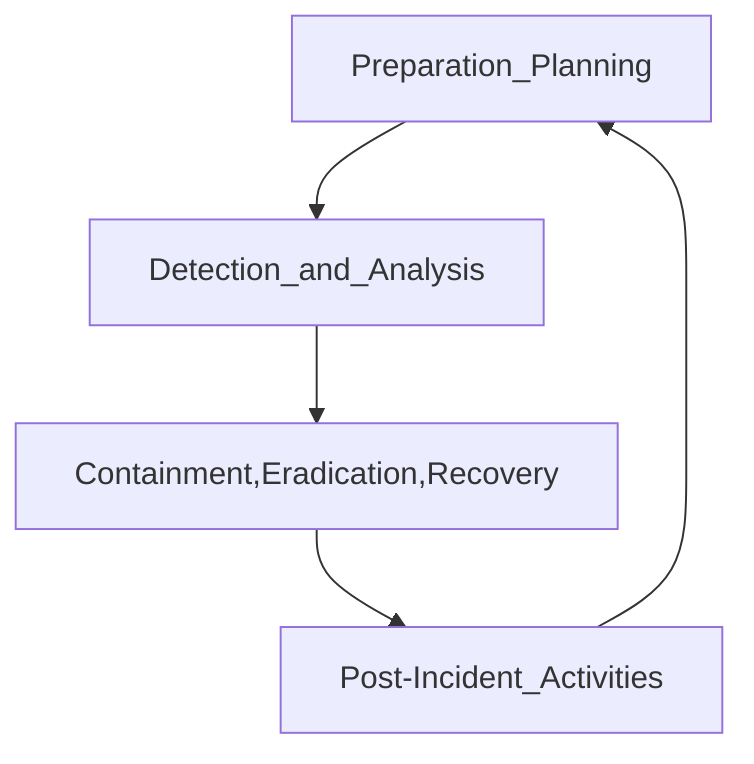

### IR strategy

- Response team
- Processes
- Technological solutions
- Continous process

**NIST** establishes Industry standards:
##### IR plan

**IR Lifecycle**

*Phase 1:* Preparation and Planning
- IR Team composition
*Phase 2:* Detection and Analysis
- Build detection capabilities (IDPS, SIEM solutions, Manual monitoring)
###### Digital Forensics
- Provides tools and techniques
- Collect evidence
- Analyze evidence (drives, files, memory...) -> identify threat actors

*Phase 3:* Containment, eradication and recovery
**Containment**:
- Damage mitigation
- System isolation
- Temporary shutdown
- Document all actions
**Eradication and recovery**
- Cause remediation
- System restoration
- Technical expertise
- Data backup

*Phase 4:* Post-Incident Activities
- Restore systems
- Review
- Identify areas to improve
- Incorporate lesson learned
- Communicate stakeholders

### Digital Forensics in IR

- Analyze data breaches
- Uncover the extent of intrusions
- Determine adversarie's tactics
- Mitigate current threats
- Fortify defenses
- Provide info to *Phase 4*

**Process:**
- Collect
--> *Documentation*
--> *Evidence collection*
	Adhere to strict **chain of custody** (Who?, When?, What action?)
	**Chronological documentation**: Seizurem Custody, Control, Transfer, Analysis, Evidence disposition
- Analyze
- Plan data gathering