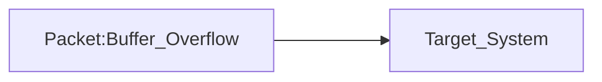
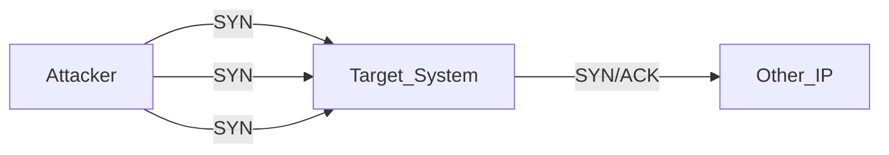
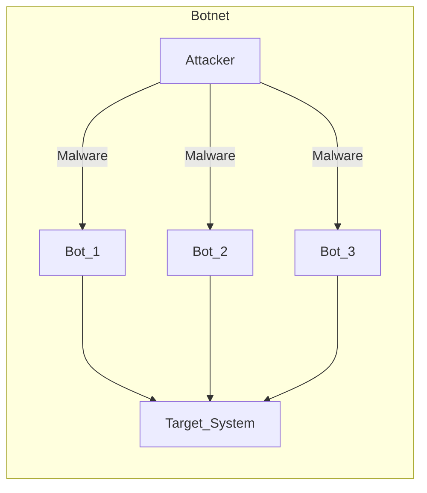

Affects **Availability**

### Ninja
Very targeted strike

It only requieres **one packet**.

### 1K Cuts

##### SYN Flood Attack
Attacker starts a three-handshake communication (see [[TCP IP]])

The attacker DOES NOT give their IP address. Therefore, the System sends the SYN/ACK message to another system. Each SYN holds resources of the target system (since it must wait for the response to the SYN/ACK)
**It holds the resources while waiting for an answer**  -> It will never get the respond ACK that it expects 

### DDoS (*Distributed Denial of Service*): 1K Cuts * N 

N is the number of users involved. The attack comes form various places

## Protection

- Infinite capacity (not affordable)
- **Redundancy**: do not depend on only a system to provide your services
- **Pacing**: limit the traffic that the system will accept
- **Filtering** - In/Out: such as Egress
- **Hardening**: remove unneeded services (capabilities, IDs)
- **Patching**: latest software
- **Monitoring - SIEM/XDR**
- **Incident Response - SOAR**
