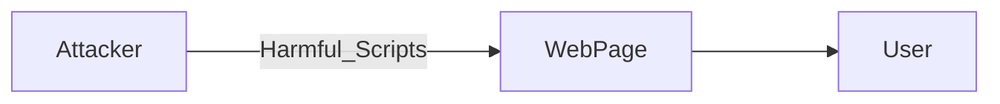
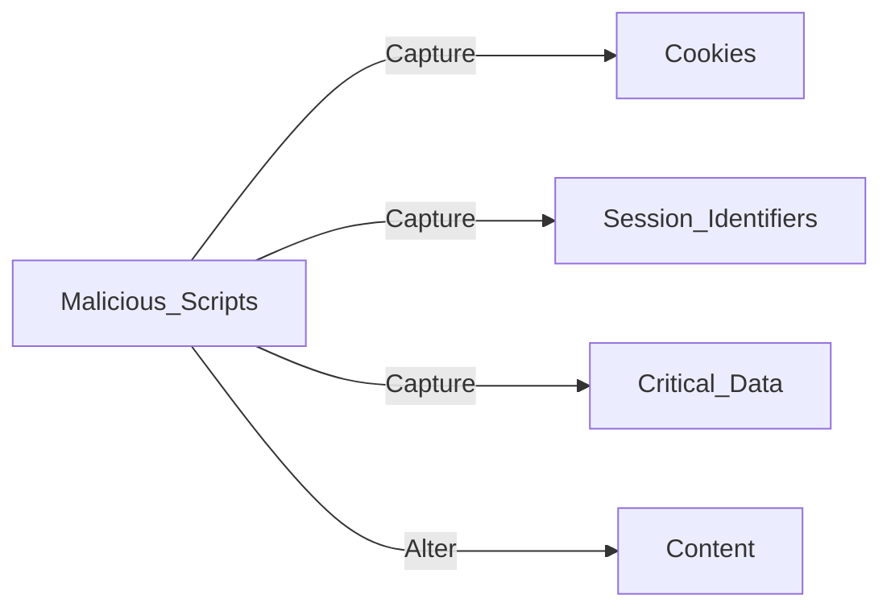
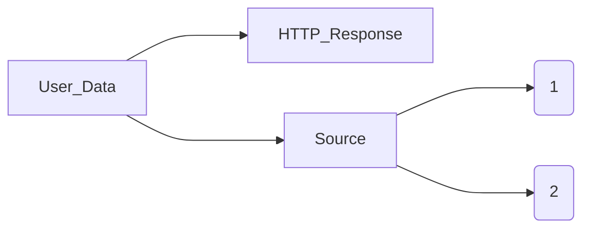

>[!info]
>**Definition:**
>- Inject malicious code
>- Manipulate data through remote commands
>
>**Possible outcomes:**
>- Violate rules
>- Disclose sensitive information
>- Grant control

*Analogy*: Slip a harmful note inside a stack of legitimate notes

- Common in older systems

## SQL Injection Attacks

- Database misinterpretation
#### SQL
- Talk to databases
- Manage information

#### Techniques

Gain unauthorized access -> Log in as authorized users -> Recover / Erase / Modify data

#### Consequences

- *Confidentialiy breach*
- *Authentication breach*
- *Authorization loss*
- *Integrity violation*

## XSS Attacks

- Security breach where attackers embed harmful scritps into webpages
- Client-side script execution
- Input sanitization failure

#### Types of XSS attacks

##### Server XSS

****
**(1) Reflected server XSS**
- Immediate response to a user's request carries a security risk

**(2) Stored server XSS**
- Risk lies in data saved on the server

*Role of the browser*
- Display the server's response

##### Client XSS

---

-> ***DOM Manipulation***
	- Within the DOM
	- Delivered by the server
	- Upon page load
	- User's data
	- Stored information

**Reflected client XSS**
- Immediate user inputs

**Stored client XSS**
- Previous stored data updates the DOM