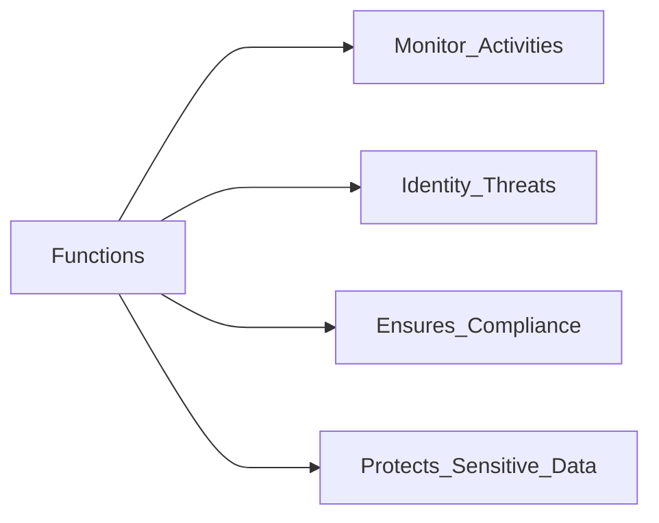

Security measures

#### Access Management

Integral aspect of access control
Includes processes and technologies
Controls and monitors users access

#### Identities
- Helpful for Access Management
- Unique digital representations (Ip, username, password)
- Unlock resources based on designated access levels
- Focus on individuals
##### Attributes
- Digital Footprint (height, age, gender...)
- Pivotal in AM
-> **Vital asset** makes it a target

#### Access Control Methods

*Traditional Methods*

- **Usernames**
	Lacks security --> Require measures
- **Certificates**
	Digitally signed documents
	Stored on devices or physical tokens
- **Tokens**
	Generate code
	Present certificate
- **Secure Shell (SSH) keys**
	Alternative 
	Securely store cryptographic key pairs
- **Smartcards**
	Securely store credentials
	Perform cryptographic operations

*Innovative Methods*

- **Biometric Systems**
	Leverage unique physical characteristics
- **Behavioral** **biometrics**
	Behaviour patterns
- **Geolocations** and **time-based restrictions**
- **[[Multifactor Authentication]] (MFA)**
- **[[Single-Sign On]] (SSO)**
	Access multiple applications with a single click
	Reduces password fatigue

#### Access Control Methods

