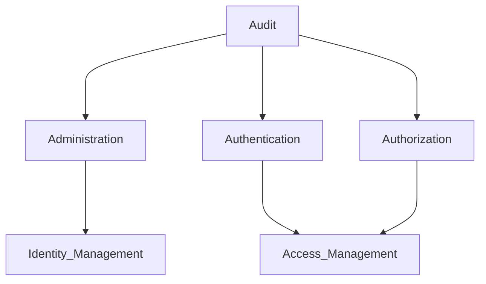

Create a first line of defense at the edge of the network within a firewall
*:(  : (* |  **:) :)**
**:)**   *:(* |  **:)** *:(*

Sometimes there are bad guys inside the network and viceversa.
--> Move the line of defense from teh edge of the network to the end user

### **Four As**
#### Administration

Account creation and deletion
--> *Identity Management*
-->*Provisioning / Deprovisioning*

#### [[Authentication]]

**Who** are you?
--> *Access Management*
#### [[Authorization]]

Are you **allowed**?
--> *Access Management*
#### Audit

The previous As operate correctly

