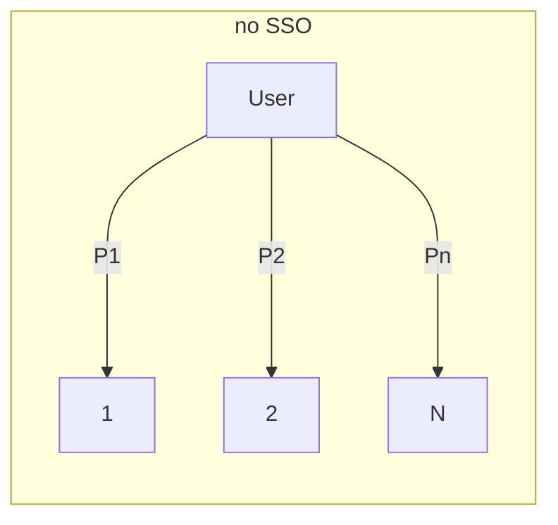
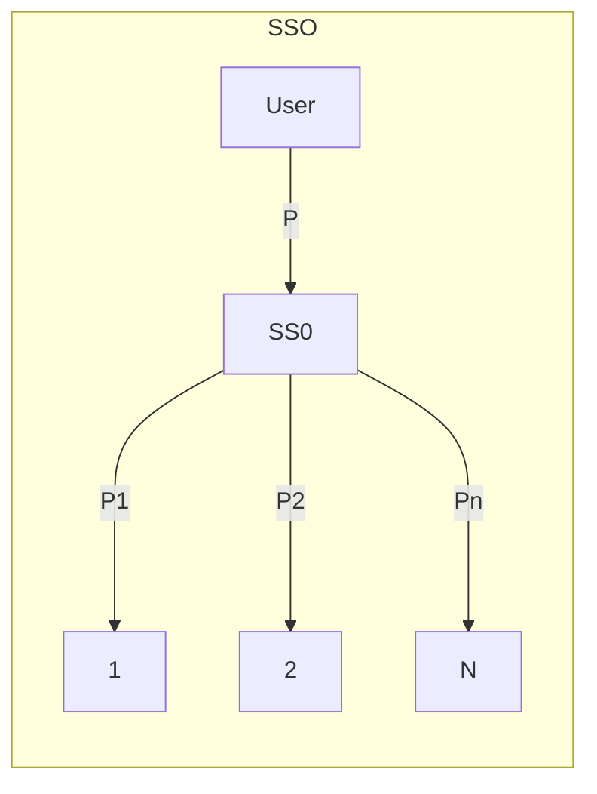

Strong passwords --> Hard to remember

```mermaid
flowchart LR
subgraph no SSO
	User --P1 --->1
	User --P2 --->2
	User --Pn --->N
end

```

```mermaid
flowchart LR
subgraph SSO
	User --P -->SS0 --P1 --->1
	SS0 --P2 --->2
	SS0 --Pn --->N
end

```
SSO => Lessens the Attack Surface

**Protect SSO with MFA**

ğŸ‘Security
ğŸ‘Reduce costs
ğŸ‘User Experience