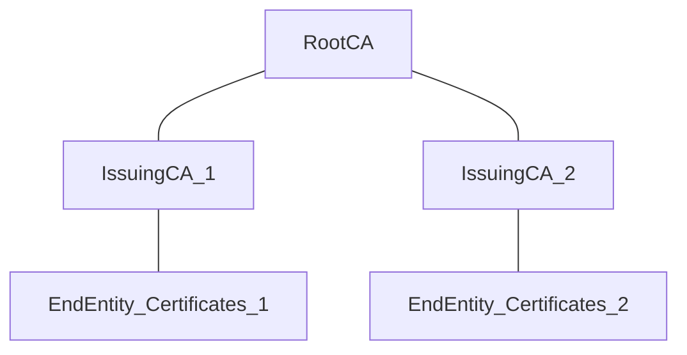
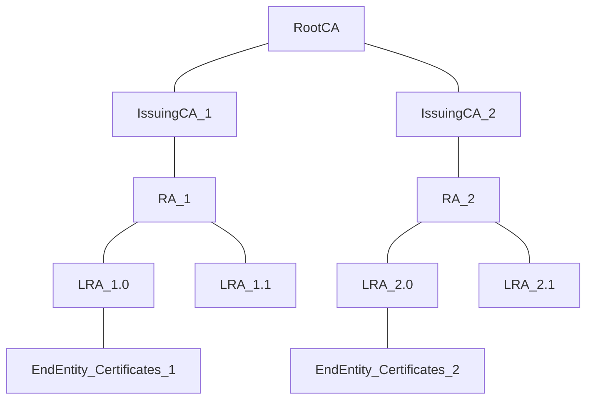

Direct registration is prevented through **Registration Authorities (RAs)**

Siemens Maufacturer: **Root CA** ------- offline
-
Manufacturer: **Issuing CA                 Signer: **Issuing CA**  -------------  Siemens Trust Center
-
Siemens Mobility Manufacturing Facilitites: **LRA** --> acts as a proxy in front of the manufacturer Issuing CA to prevent the enrollment of certificates for non existing fake devices

