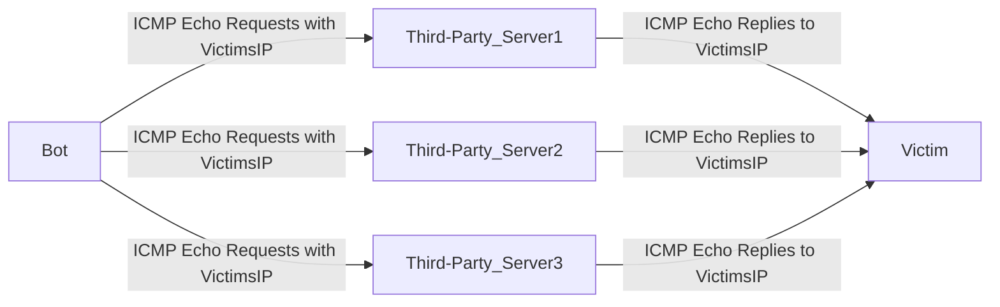
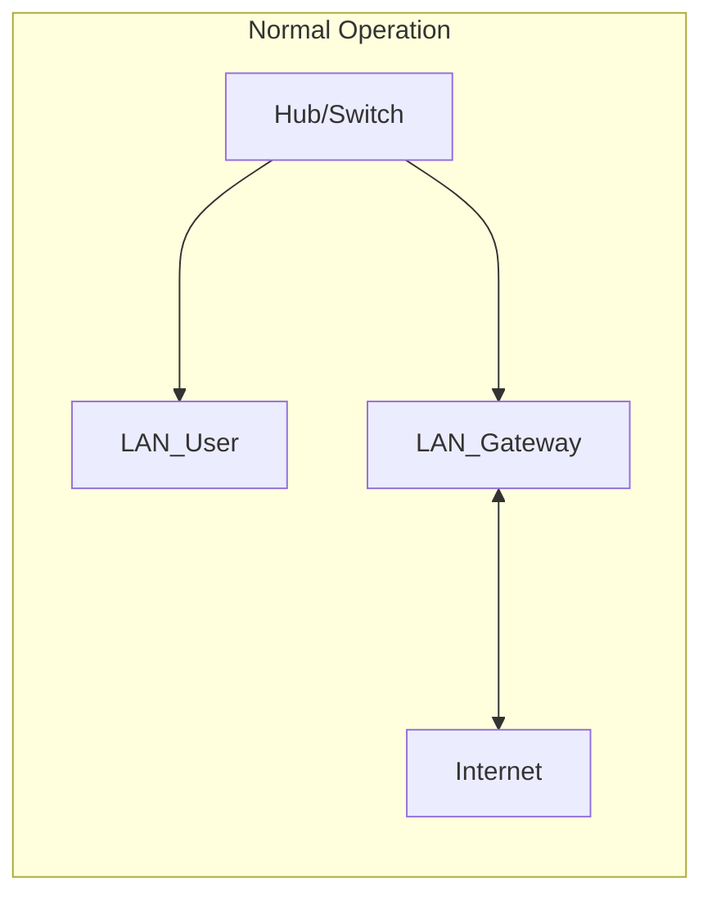
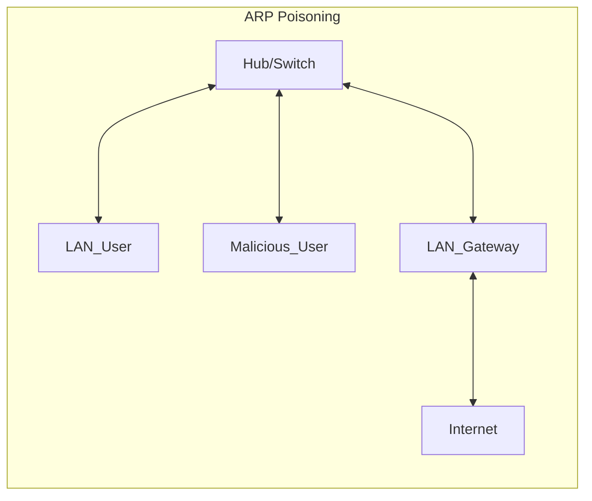
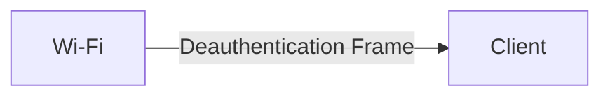
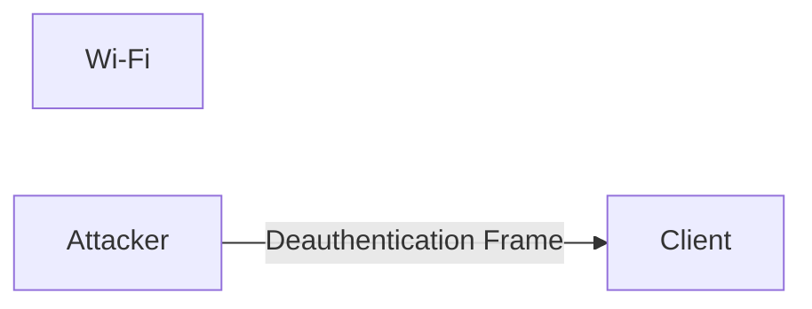

# Denial of service attacks

Affects the availability

### Limitations
- Massive amount of bandwith
- Easy to block based on IP address

## Distributed DoS Attack

Uses a botnet to overwhelm the victim's sytems

### Smurf Attack

Amplified requests (**8x Amplification Factor**)
Small Requests (64 bytes) --> Large Replies (512 bytes)

# Eavesdropping Attacks

- Rely on a **compromised comunications path**:
	Network device tapping
	DNS poisoning
	ARP poisoning
- Easily defeated by encryption

## On-Path Attacks
### Man-in-the-Middle Attack
- Defeats encryption protection

### Man-in-the-Browser Attack
- Exploit flaw in browsers and browser plugins

## Replay Attacks
-  The attacker can'see the encoded credentials
--> **PREVENTION:** Token or Timestamp

## SSL Stripping
Tricks browser into using unencrypted communications

---

# DNS Attacks

Hierarchical DNS Lookups

## DNS Poisoning
Insert incorrect DNS records at any point in the hierarchy

## Typosquatting
An attack that consist of registering domain names similar to official sites, hoping that users will make a typo and visit their site

## Domain Hijacking
An attack where the attacker gains control of an organization's domain registration

## URL Redirection
Attacker places redirects on a trusted site to content hosted on a malicious site

## Domain Reputation
Threat intelligence capability that scores domains as either benign or malicious

---

# Layer 2 Attacks
**Data Link Layer**

##### Address Resolution Protocol (ARP) 
A protocol that translates logical (IP) addresses into the hardware (MAC) addresses on local area networks

**MAC Addresses** ^a38c33
- 48 bits and 6 octets
- First three octets hel to identify OUI (*Organization Unique Identifier*)

## ARP Poisoning
Only works on a local network
The system beleicies the "Malicious User" is the gatweay, so it sends all traffic

## MAC Flooding
- Switches maintain MAC address tables (*with limited size*) in memory
- MAC flooding attacks attempt to overwhelm this table
- Rapidly cycle addresses on a single system
- Causes switches to forget where systems are located (*does not know the port*)
- Switches respond by broadcasting traffic

---
# Network address spoofing

## MAC Spoofing/cloning
Alter the assigned hardware address of a system to assume a false identity or enageg in a MAC flooding attack
--> Default is created by manufacturer but it can be changed by users with root password

## IP Spoofing
Alters the IP address of a systems and normally can't be used for two-way communication
--> Used for DoS attacks

### Anti-Spoofing Techniques

#### Ingress Filtering
Block inbound traffic that contains spoofed source addresses
--> Implemented on router, firewall or switch

#### Egress Filtering
Clocks outbound traffic that contains spoofed source addresses
--> Implemented on router, firewall or switch

---
# Wireless attacks

## WEP attacks
Depend upon captuing intialization vectors (IVs)

WPA, like WEP, depends upong RC4
WPA adds the Temporal Key Integrity Protocol (TKIP): vulnerable
--> WPA is no longer considered secure

**Wi-Fi Protected Setup (WPS)**
WPS allows quick setup of devices

## WPS Attacks
Flaws in WPS make it trivial to guess the WPS PIN
- 10000000 possibilities, a flaw requires 11000 guesses
With the PIN, you get the encryption key
PIN can't be changed
⚠ Disable WPS

---

# Propagation Attacks

## Jamming and Interference
- DoS attacks are easy on wireless
- The radio spectrum is open
- The attackes brings a powerful transmitter into the vacinity of the wireless network and broadcasts a very powerful signal that overpowers the legitimate wireless access points
- **The loudest signal always wins**

## Wardriving attacks
- Attackers cruise neighborhoods and commercvial areas, using tools that capture information about Wi-Fi netwroks

#### TOOLS: wiggle.net

---
# Rogue Access Points

- Bypassing Authentication (even WPA3)
- Interference

### Rogue AP Detection
- Enterprise-grade wireless has built-in instrusion detection capabilities
- Unknow radios on the network can be identifies
- Handheld tools can also help pinpoint them

# Evil Twins
A hacker sets a fake access point with the SSID of a legitimate network.
The attacker controls the network, so they ca use DNS poisoning and similar tactics

### Tool: Karma toolkit

---

# Dissassociation attacks
Speed up other wireless attacks
Wireless access points may force a wireless device to imediately disconnect from the network

### Deauthentication Frame
Sent by the Access Point to the client

## Disassociation Attack
- Gather information for cryptographic attacks
- Conduct DoS on wireless networks

---

# Bluetooth and NFC attacks

### Near-Field Communication (NFC)
- Is used for very short range links between devices (30-50 feet)
- Is most commonly seen in Bluetooth

#### NFC Security
- Turn off discoverable mode when not in use
- Apply firmware updates
- Watch for suspicious activity
## Bluejacking
- An attacker sends Bluetooth spam to a user's device
- The attacker tries to entice user to take some action
- Bluettoth spam/phising

## Bluesnarfing
- Exploits firmaware flaws in older Bluetooth devices
- The attacker forces pairing between devices
- The connection grants access to the device

---

# RFID Security

- Some Passports sysmbol contain RFID chips
- Transit cards and credit cards often contain RFID chips to allow contactless reading
- Electronic toll systems use RFID
- Warehouses uses RFID

## RFID Security Concerns
- Shoul have strong authentication and encryption to protect the integrity of RFID systems
- Consumers want privacy safeguards to protect their personal information