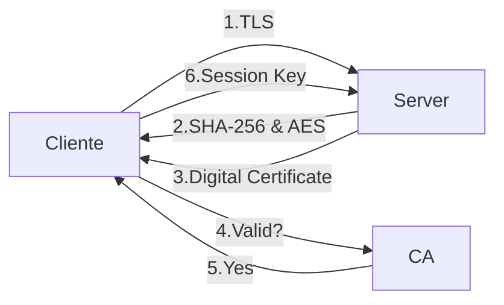

# TLS

Depends upon pairings of encryption and hash functions known as cipher suites.
⚠ Not cryptographic algorithm by itself

Seesion key (*ephemeral keys*) is encrypted by the client using the server's public key

> [!important] SSL
> Insecure TLS predecessor 

**OpenSSL** --> open-source TLS
- Heartbleed Bug

# IPsec

**Internet Protocl**

Secure the entire packet payload

#### Encapsulating Security Payload (ESP)
Confidentiality and Integrity protection for packet payload

#### Authentication Header (AH)
Provides integrity protection for packet headers and payloads

**ESP + AH** --> Confidentiality + Integrity

### Security Association (SA)
Identifies cryptographic algorithms that IPsec can support

### USES

#### Site-to-Site VPNs
Encrypted tunnels connecting two network together in a manner that is transparent to users
--> IPsec tunnel: **Tunnel mode**
#### End-User VPNs
Provide encrypted remote network access for individual systems
--> IPsec: **Transport Mode**

---

# Securing common protocols

#### Web page protocols HTTP -- HTTPS
HTTPS adds TLS to web browsing

| Protocol | Port |
| -------- | ---- |
| HTTP     | 80   |
| HTTPS    | 443  |
#### Remote access protocols: Telnet -- SSH
Telnet uses CLI access
SSH is a secure alternative

| Protocol | Port | Description                                                                |
| -------- | ---- | -------------------------------------------------------------------------- |
| Telnet   | 23   | Remotely control a devices, console, or command shell, not encrypted       |
| SSH      | 22   | Romotely control a device securely via console or command shell, encrypted |
| RDP      | 3389 | Remotely control a computer via GUI                                        |

#### File transfer Protocols: FTP -- FTPS or SFTP or SCP
FTP is insecure
TFTP is also insecure
FTPS adds TLS to FTP
SFTP tranfers files over SSH
Secure Copy (SCP) provides secure command-line transfer over SSH

| Protocol | Port | Description                   |
| -------- | ---- | ----------------------------- |
| FTP      | 21   | File transfers, not encrypted |
| SFTP     | 22   | File transfers, encrypted     |
#### Voice and video -- TLS
RTP-based VoIP services should use **Secure RTP**

#### Network Time Protocol (NTP) -- NTPSec
Synchronizes system clocks

#### Email Protocols

| Protocol | Unencrypted Port | Encrypted Port | Description                      |
| -------- | ---------------- | -------------- | -------------------------------- |
| POP      | 110              | 995            | Receiving and downloading emails |
| IMAP     | 143              | 993            | Receiving emails                 |
| SMTP     | 25               | 465            | Sending and receiving emails     |

^c189f9

#### Encrypt email messages and attachments: S/MIME

#### Secure Networking Protocols
- Use DNSSEC to add digital signatures to DNS
- Limit authorized DHCP servers
- LDAPS offers a secure alternative to LDAP

| Protocol | Port          | Description                                                          |
| -------- | ------------- | -------------------------------------------------------------------- |
| DHCP     | 67, 68        | Automatically assign IP addresses                                    |
| DNS      | 53            | Resolves or translates domain names to IP addresses                  |
| SMB      | 137-139 / 445 | Enables file and printer sharing on a network                        |
| SNMP     | 161           | Monitors the network                                                 |
| LDAP     | 389           | Stores, authenticates, and shares passwords, usernames, and accounts |

##### *More on SMB*
SMB (Server Message Block). This communication protocol provides shared access to files, printers, and serial ports between endpoints on a network. We mostly see SMB services running on Windows machines.
**An SMB-enabled storage on the network is called a share** . These can be accessed by any client that has the address of the server and the proper credentials. Like many other file access protocols, SMB requires some security layers to function appropriately within a network topology. If SMB allows clients to create, edit, retrieve, and remove files on a share, there is a clear need for an authentication mechanism. At a user level, SMB clients are required to provide a username/password combination to see or interact with the contents of the SMB share. Despite having the ability to secure access to the share, a network administrator can sometimes make mistakes and accidentaly allow logins without any valid credentials or using either guest accounts or anonymous log-ons . We will witness this in the following sections.

Smbclient will attempt to connect to the remote host and check if there is any authentication required. If there is, it will ask you for a password for your local username. We should take note of this. If we do not specify a specific username to smbclient when attempting to connect to the remote host, it will just use your local machine's username. That is the one you are currently logged into your Virtual Machine with. This is because SMB authentication always requires a username, so by not giving it one explicitly to try to login with, it will just have to pass your current local username to avoid throwing an error with the protocol.

`$ smbclient -L {target_IP}`
`$ smbclient \\\\{target_IP}\\ADMIN`