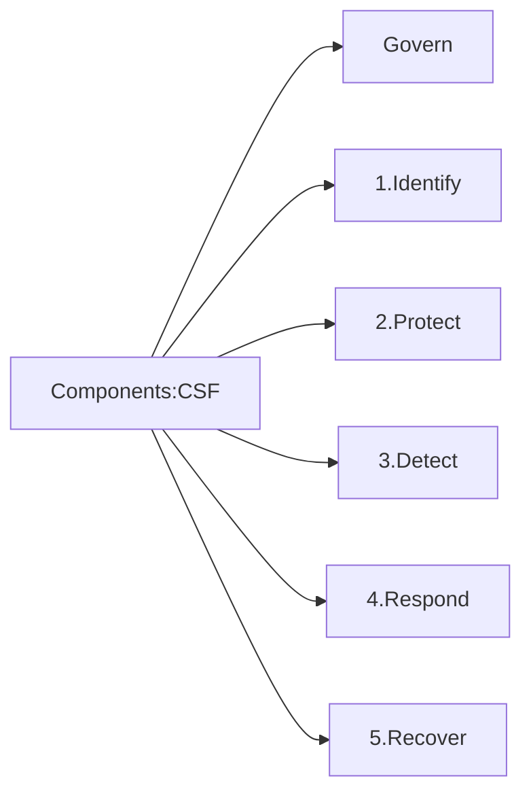

# NIST Cybersecurity Framework (CSF) 2.0

- Connects all components
- Enables quick identification, handling, and resolution
- Safeguards components
- Develops and tests plan
### CSF Components: Govern

--> Creates cybersecurity policies
--> Safeguards the organization's mission
--> Helps devise a cybersecurity plan

### CSF Components: Identify

--> Understand cybersecurity risks
--> Recognize risks associated with the organization's assets
--> Improve policies and procedures

### CSF Components: Protect

--> Use security measures to mitigates cyberthreats
--> Safeguard the organization's assets
--> Implement security measures: 
	- Control of access rights permissions
	- Creating awareness
	- Ensuring data security
	- Protecting HW and SW

### CSF Components: Detect

--> Identify potential cyberattacks
--> Recognize signs of cyberattacks

### CSF Components: Respond

--> Prepare a response to discovered cybersecurity incidents
--> Handle the cyber incidents

### CSF Components: Recover

--> Restores assets and operations affected
--> Normalize to reduce the impact of cyberattacks

---

## CSF Tiers

> [!info]
> **Tier 1**: Partial
> **Tier 2**: Risk-informed
> **Tier 3**: Repeatable
> **Tier 4**: Adaptive

### Tier 1

Impromptu or reactive methods
Lack of cybersecurity risk management

### Tier 2

Exhibit awareness of the risks
Apply risk-informed cybersecurity procedures
No set procedures

### Tier 3

Create and implement cybersecurity procedures
Approve their risk management policies

### Tier 4

Modify their cybersecurity procedures
Use the latest risk management techniques