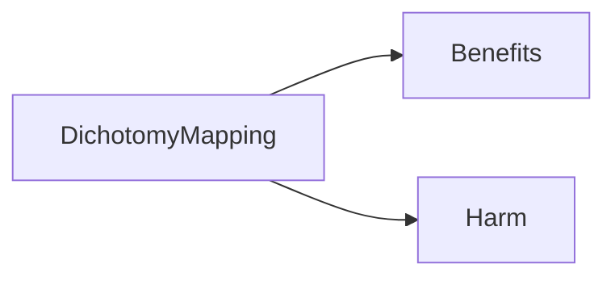

## Privacy concerns

--> **Mitigation plan**:
- Transparent data handling practices
- Robust privacy protections

## Job displacement

--> **Mitigation plan**:
- Reskill and upskill workers
- Foster collaborative relationship

## Algorithmic bias and opacity

--> **Mitigation plan**:
- Ensure transparency and accountability
- Promote fair and equal decision-making

# IBM Pillars of trust

##### Explainability

##### Fairness

##### Robustness

##### Transparency

##### Privacy

# Implementation of AI Ethics

### Guidelines

1. Augmentation of human intelligence (not replacement)
2. Data belongs to their creator
3. Solutions should be transparent and explicable

### Activities

### Fix

- Guardrails
- Data
- Open-source (tools to detect bias)