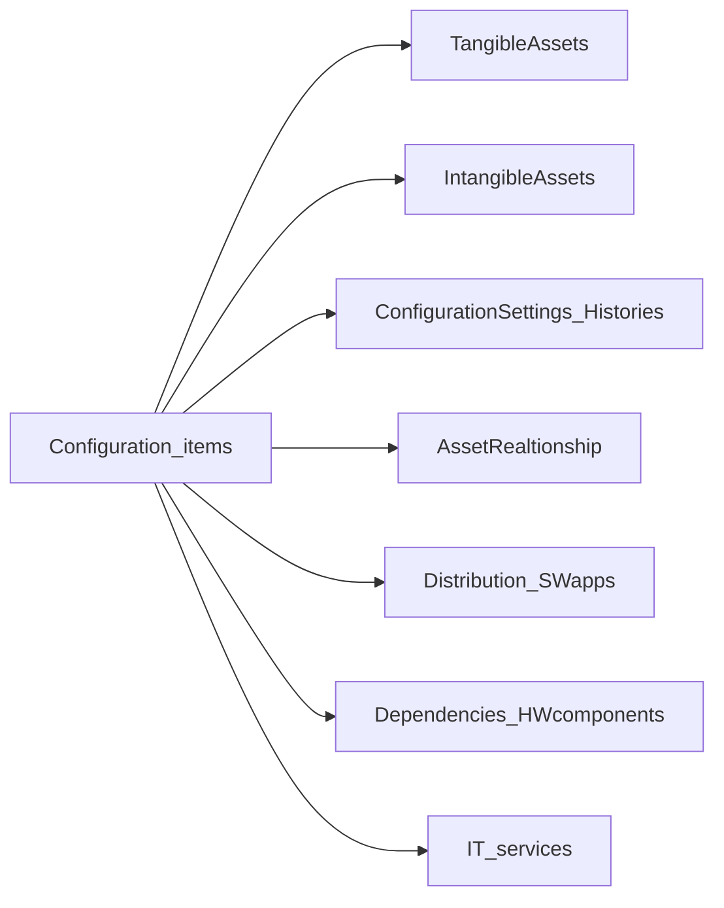
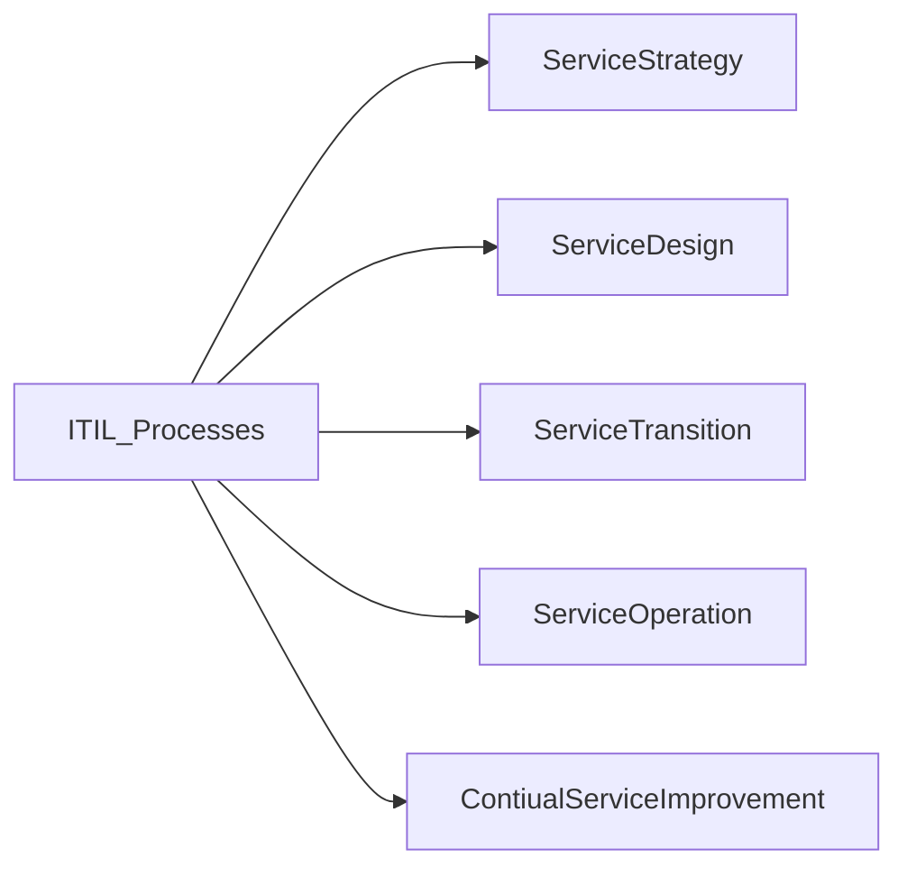

> [!info] ITIL
> A comprehensive set of guidelines for IT services
> A recognized framework across the globe
> Ensures IT services are aligned with the needs of the business

--> Manages and mitigates risks associated with IT services
--> Emphasizes the best practices in IT service management
--> Provides guidelines for identifying, preventing, and responding to security incidents
--> Ensures cybersecurity is part of risk management strategies
--> Minimizes potential impact of cyberthreats

# Configuration Management Database (CMDB)

> [!info] 
> Acts as a detailed digital directory of IT assets --> CI
> Holds data about critical IT items and who uses them
> Tracks IT items, location, connections, changes
> Helps fix problems faster

## Configuration items (CI)

## Benefits of CMDB

- Keeps IT services stable, reliable and efficient
- Helps incident management
- Helps change management
- Helps asset management
- Support compliance and security
- Manages IT infrastructure

# IT Service Management (ITSM)

- Activities, policies, and processes to improve IT services
- Strategizes and implements long-term IT solutions
- Includes ITIL as a subset
- Applies the ITIL practices in the context of delivering and managing IT services
- Manages IT services to achieve business goals

# ITIL Processes

## 1. Service Strategy

- Creates curstomer value through IT services
- Defines the market
- Develops service offering
- Creates financial plans
- Manages resources, risks, opportunities
- Guides ITIL lifecycle

## 2. Service Design

- Scalable, reliable, efficient services
- Service catalog management
- Service level management (meet *Service Level Agreements (SLAs*)
- Capacity management
- Availability management

### Processes
#### IT Service Continuity Management
Ensures minimum agreed service levels

#### Information Security Management
Aligns IT security with business security

#### Supplier Management
Ensures contracts and agreements align with business needs

#### Design Coordination
Manages service design activities, and resources

## 3. Service Transition

- Moves services from the design stage to the operational stage
- Manages changes in a controlled way
- Ensures service changes are predicted and managed
- Ensures parties understand the implications of the changes

### Processes

#### Change Management
Records and evaluates changes
#### Service Asset and Configuration Management
Ensure assets are indentified, controlled, and properly cared for throughout their lifecycle
#### Release and deployment management
Ensures the integrity of the live environment
#### Knowledge management
Gathers, analyzes, stores, and shares knowledge and information

## 4. Service Operation

- Ensures that services are delivered at agreed levels
- Focuses on service value and meeting end-user expectations

### Processes

#### Incident Management
Minimizes impact on business operations
#### Problem Management
Identifies root cause of incident and prevent recurrence
#### Event Management
Ensures efficient processing of event
#### Request fulfillment

#### Access Management
#### IT infrastructure Management
- Service Desk
- Technical Management
- IT Operations Management
- Application Management

## 5. Continual Service Improvement

- Ongoing improvement 📈
- Reviewing performance data
- Assesing services against customer requirements
- Identifying gaps
- Implementing initiatives
- Utilizing Deming Cycle (*Plan-Do-Check-Act*)

