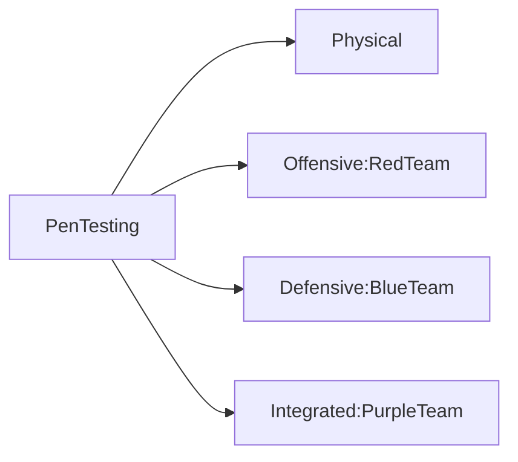
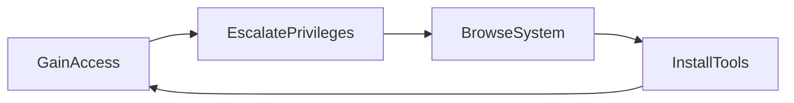

## Internal Audit

- In-Depth examination of its internal controls, methods and procedures
- Conducted by the audit department
- Ensure compliance with regulatory requirements, internal policies, and industry best practices
- Identify weaknesses or inefficiencies of operations and recommend enhancements

## Compliance Audit

- Determine adherence to legal, regulatory, and contractual obligations
- Ensure all practices align with the specified standards and regulations
- Provide an impartial assessment, highlighting gaps in compliance
- Guide necessary adjustments

## Audit Committee

Supervises:
- Integrity of financial reporting
- Effectiveness of the internal control systems
- Compliance with legal and regulatory requirements
- Performance of internal and external audit functions

Ensures:
- Audits are conducted efficiently, independently, and effectively
- Direct communication channel between the board and the auditors

## Self-assessments
- Examines and evaluate its processes, controls, and outcomes
- Review performance and compliance levels before external audits
- Identify and rectify any discrepancies or areas of concern
- Promote a culture of continual improvement and awareness

## Attestation
- Verifies the security controls and procedures
- Comprehensive review and validation by a third-party auditor
- Ensures robust security mechanisms with evidence or attestation to substantiate those claims
- Establishes trust with stakeholders, customers, and partners

## External assessments
- Involves independently third-party auditors or regulatory agencies
- Includes regulatory examinations
- Includes independently third-party audits
- Maintain transparency, accountability, and trust among stakeholders

## Penetration Testing
--> Privilege Escalation and Lateral Movement

- Assesses the security of information systems
- Simulates an attack from malicious outsiders (offensive) or insiders (defensive)
- Assesses the effectiveness of security policies, controls, and overall defense mechanisms

**Phases:**
- *Passive reconnaissance*: gathers information about the target without directly interacting with the systems
- *Active reconnaissance*: engages with the system directly to gather more detailed insights

**NIST Attack Stage**

**PTES Methodology**
- Pre-engagement Interactions
- Intelligence Gathering
- Threat Modelling
- Vulnerability Analysis
- Exploitation
- Post Exploitation
- Reporting