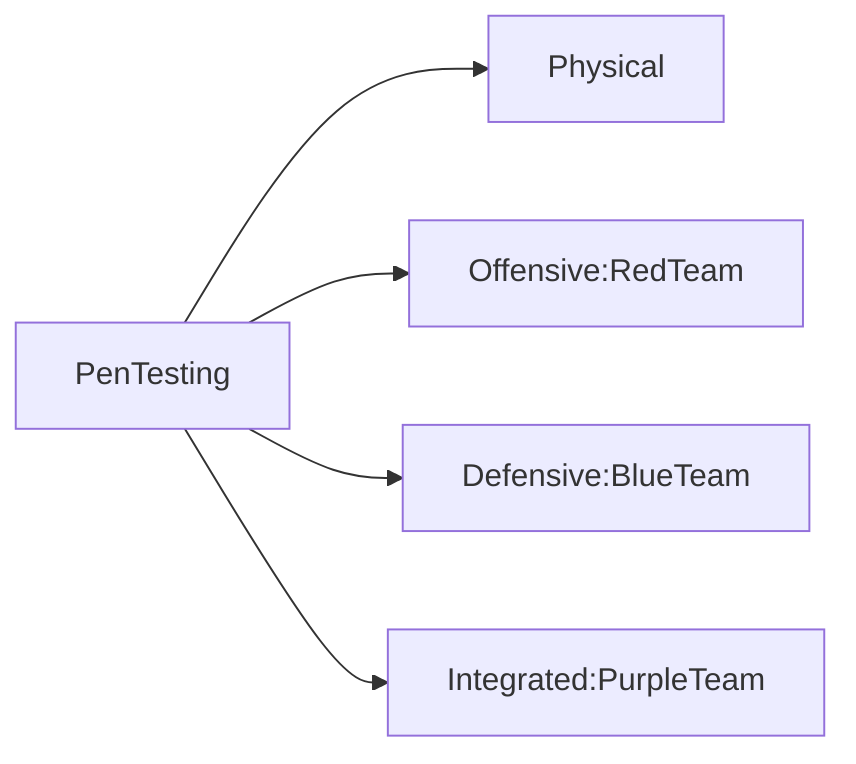
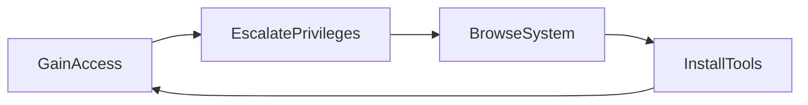

## Internal Audit

- In-Depth examination of its internal controls, methods and procedures
- Conducted by the audit department
- Ensure compliance with regulatory requirements, internal policies, and industry best practices
- Identify weaknesses or inefficiencies of operations and recommend enhancements

## Compliance Audit

- Determine adherence to legal, regulatory, and contractual obligations
- Ensure all practices align with the specified standards and regulations
- Provide an impartial assessment, highlighting gaps in compliance
- Guide necessary adjustments

## Audit Committee

Supervises:
- Integrity of financial reporting
- Effectiveness of the internal control systems
- Compliance with legal and regulatory requirements
- Performance of internal and external audit functions

Ensures:
- Audits are conducted efficiently, independently, and effectively
- Direct communication channel between the board and the auditors

## Self-assessments
- Examines and evaluate its processes, controls, and outcomes
- Review performance and compliance levels before external audits
- Identify and rectify any discrepancies or areas of concern
- Promote a culture of continual improvement and awareness

## Attestation
- Verifies the security controls and procedures
- Comprehensive review and validation by a third-party auditor
- Ensures robust security mechanisms with evidence or attestation to substantiate those claims
- Establishes trust with stakeholders, customers, and partners

## External assessments
- Involves independently third-party auditors or regulatory agencies
- Includes regulatory examinations
- Includes independently third-party audits
- Maintain transparency, accountability, and trust among stakeholders

## Penetration Testing
--> Privilege Escalation and Lateral Movement

- Assesses the security of information systems
- Simulates an attack from malicious outsiders (offensive) or insiders (defensive)
- Assesses the effectiveness of security policies, controls, and overall defense mechanisms

**Phases:**
- *Passive reconnaissance*: gathers information about the target without directly interacting with the systems
- *Active reconnaissance*: engages with the system directly to gather more detailed insights
##### **Passive reconnaissance**

Passive reconnaissance involves stealthily gathering information about a target system or network without any direct interactions between the attackers and the target. It enables attackers to exploit unsecured, publicly available information to create target profiles without raising alarms. Here are examples of passive reconnaissance techniques:

- **Websites** provide attackers with information on organizational structure and technologies and alert them to potential weak spots. For example, attackers can exploit outdated content management systems (CMS) on company websites and use unpatched vulnerabilities to access internal databases.
- **Domain registrations** equip attackers with extensive information on the domain owner. This information can be used to launch phishing or impersonation attacks. For instance, an attacker can find the personal contact details of domain owners and send phishing emails to steal their login credentials.
- **Social media** enables quick and easy access to data on employee roles, company culture, and other public information. Attackers can potentially use this information for spear-phishing or social engineering. For example, an attacker may identify a company's leadership personnel on LinkedIn and send them personalized phishing emails to trick them into revealing sensitive data.
- **Public records**, such as business filings or legal documents, can give attackers insights into a company's operations and key personnel. They can use this information to plan targeted attacks. For example, attackers can gather details about company executives from public filings, such as government databases, and launch a spear-phishing campaign against them.
- **Job postings** often reveal information on the technologies and systems used by the company that attackers can exploit if there are known vulnerabilities. For instance, an attacker might see that a company was using specific software from a job posting and use a known vulnerability in that software to attack.
- **Online forums and communities** provide a portal to extensive insider information and industry trends on online forums. Attackers might use this knowledge to exploit known issues or for social engineering. For example, an attacker can find details on an organization's recent security problems on a forum and leverage it to create a targeted phishing attack.

##### **Active reconnaissance**

Active reconnaissance involves direct engagement with a target system or network to gather detailed information, which can help in planning attacks. Unlike passive reconnaissance, it requires direct interaction with the target, which can trigger alerts. Here are examples of active reconnaissance techniques:

- **Network mapping tools** help discover live hosts, open ports, and public services, creating a detailed map of the network infrastructure. Attackers can use this map to identify vulnerable points within the network. For example, an attacker might use a network mapper to find an open port running outdated software, which they can then exploit to gain unauthorized access.
- **Ping sweeps and traceroutes** uncover potential security gaps and entry points for attacks. Attackers use ping sweeps to identify active hosts and traceroutes to map the network layout by revealing the data paths and network topology. For instance, an attacker might perform these scans to discover the network's structure and pinpoint weak areas to target with specific attacks.
- **Banner grabbing** captures information about the services and software versions running on a server. Attackers use banner grabbing to identify specific software vulnerabilities. For example, an attacker might use banner grabbing to determine the server's software version and exploit a known vulnerability associated with that version.
- **Packet sniffing tools**, like Wireshark, capture and analyze unencrypted network traffic, allowing attackers to extract sensitive information such as login credentials. This data can be used to hijack sessions or access secure systems. For instance, an attacker might capture network traffic to obtain login information, which they could then use to change credentials or gain unauthorized access to the system.
- **Vulnerability scanning tools** like Nessus and Open Vulnerability Assessment System (OpenVAS) identify and assess known vulnerabilities in hosts and services. Attackers may exploit these vulnerabilities to gain unauthorized access or disrupt services. For example, a vulnerability scanner might reveal an unpatched flaw on a server, which the attacker could then exploit to breach the system.
- **Domain name system (DNS) enumeration** involves discovering domain names, internet protocol (IP) addresses, DNS records, and subdomains associated with a target. Attackers use DNS enumeration to uncover hidden subdomains that could be targeted for attacks. For example, an attacker might find a hidden subdomain through DNS enumeration and target it with a DNS spoofing attack.
- **Social engineering** includes manipulating individuals to extract sensitive information or gain access to systems. Attackers exploit human psychology rather than technical vulnerabilities. For example, an attacker might pose as an information technology (IT) technician and trick an employee into revealing their login credentials over the phone, allowing the attacker to access secure network parts.
- **Dumpster diving** is the process of searching through discarded documents and other physical waste to find valuable information. Attackers can use this information to plan and execute targeted attacks. For instance, an attacker might retrieve sensitive documents from a company's trash and use the information to launch a targeted attack against the organization.

## **Summary**

In this reading, you learned how passive and active reconnaissance techniques are used to gather information about target systems in cybersecurity.

- Passive reconnaissance involves stealthily collecting data from publicly available sources to identify potential vulnerabilities without direct interaction.
- It includes gathering information from websites, social media, domain registrations, public records, job postings, and online forums without directly interacting with the target.
- Active reconnaissance requires direct engagement with the target to uncover weak points and help plan attacks.
- It includes network mapping, ping sweeps, traceroutes, banner grabbing, packet sniffing, vulnerability scanning, DNS enumeration, social engineering, and dumpster diving.

**NIST Attack Stage**

**PTES Methodology**
- Pre-engagement Interactions
- Intelligence Gathering
- Threat Modelling
- Vulnerability Analysis
- Exploitation
- Post Exploitation
- Reporting

## **What are penetration testing tools?**

Penetration or pen testing tools are software or frameworks used by security professionals to evaluate the security of networks, applications, and computer systems by simulating real-world cyberattacks. Their primary purpose is to help identify weaknesses in an organization's security defense before malicious attackers exploit them, enabling organizations to fix vulnerabilities and improve their security posture.

Based on their functionality, pen testing tools are categorized into seven types:

- Network scanning tools
- Exploitation tools
- Web application testing tools
- Wireless network testing tools
- Password cracking tools
- Traffic analysis tools
- Social engineering tools

Let's discuss each of these types in detail.

### **Network scanning tools**

Network scanning tools scan and map networks to help ascertain potential vulnerabilities. They are used to discover devices on a network, identify open ports, and detect services running on those ports.

Here are three network scanning tools:

- **Nmap** (short for network mapper) is a network discovery and security auditing tool. It is used to identify open ports and services on a target network and find potential attack entry points. Nmap scans large networks to discover hosts and services, creating a network map.**Source:** [https://nmap.org](https://nmap.org)
- **Nessus** is a scanner that helps identify vulnerabilities, misconfigurations, and compliance issues. It is used to scan networks for known vulnerabilities and generate detailed reports for remediation.**Source:** [https://www.tenable.com/](https://www.tenable.com/)
- **IBM QRadar** is a network security intelligence platform combining log management, threat detection, and cloud security. It is used to proactively identify vulnerabilities and security threats across network devices.**Source:** [https://www.ibm.com/security/security-intelligence/qradar](https://www.ibm.com/security/security-intelligence/qradar)

### **Exploitation tools**

Exploitation tools leverage vulnerabilities in systems, applications, or networks. They help simulate real-world attacks to test the effectiveness of security defenses.

- **Metasploit** is a framework for developing, testing, and executing exploits against a target system. It simulates real-world attacks to test the effectiveness of security defenses and identify exploitable vulnerabilities.**Source:** [https://www.metasploit.com/](https://www.metasploit.com/)
- **IBM X-Force Red** is an offensive security testing service that validates security solutions and responses. This service is provided by experts who conduct simulated attacks to identify and address vulnerabilities before they can be exploited, functioning as a proactive exploitation tool.**Source:** [https://www.ibm.com/security/services/xforce-red](https://www.ibm.com/security/services/xforce-red)

### **Web application testing tools**

Web application testing tools identify and exploit vulnerabilities in web applications, helping to protect them from common security risks.

- **Burp Suite** is an integrated platform that performs web application security testing. It includes tools for scanning, crawling, and exploiting web vulnerabilities. It identifies and exploits vulnerabilities in web applications, such as cross-site scripting (XSS) and structured query language (SQL) injection.**Source:** [https://portswigger.net/burp](https://portswigger.net/burp)
- **Open Web Application Security Project Zed Attack Proxy (OWASP ZAP)** is an open-source security scanner that helps find security vulnerabilities in web applications. It is used both in automated and manual testing to identify security issues.**Source:** [https://zaproxy.org](https://zaproxy.org)

### **Wireless network testing tools**

Wireless network testing tools assess the security of wireless networks. They help identify weak encryption keys, unauthorized access points, and other vulnerabilities.

- **Aircrack-ng** is a toolset for assessing wifi network security. It includes tools for capturing packets, cracking wired equivalent privacy (WEP) and wifi-protected access pre-shared keys (WPA-PSK), and analyzing wifi traffic. Aircrack-ng tests the security of wireless networks by capturing and analyzing traffic to identify weak encryption keys.**Source:** [https://www.aircrack-ng.org/](https://www.aircrack-ng.org/)
- **Kismet** is a wireless network detector, protocol analyzer, and intrusion detection system. It detects and analyzes wireless networks and identifies unauthorized access points.**Source:** [https://www.kismetwireless.net/](https://www.kismetwireless.net/)

### **Password cracking tools**

Password cracking tools recover passwords from data stored or transmitted in a hashed or encrypted format. They help test the strength of password policies and identify weak passwords.

- **John the Ripper** is a fast password-cracking tool that supports various password hashes. It is used to crack passwords to test the strength of password policies and identify weak passwords.**Source:** [https://www.openwall.com/john/](https://www.openwall.com/john/)
- **Hashcat**, a tool for advanced password recovery, supports many hashing algorithms. It is used to perform brute-force attacks to crack hashed passwords and assess password security.**Source:** [https://hashcat.net/hashcat/](https://hashcat.net/hashcat/)

### **Traffic analysis tools**

Traffic analysis tools capture and analyze network traffic. They help monitor network activity, identify suspicious behavior, and troubleshoot network issues.

- **Wireshark** is a network protocol analyzer that analyzes and captures real-time network traffic. It helps identify suspicious activity and troubleshoot network issues by monitoring network traffic.**Source:** [https://www.wireshark.org/](https://www.wireshark.org/)
- **Tcpdump** or Transmission Control Protocol Dump, is a command-line packet analyzer that enables users to capture, display, and analyze network packets to identify potential security threats.**Source:** [https://www.tcpdump.org/](https://www.tcpdump.org/)

### **Social engineering tools**

Social engineering tools simulate social engineering attacks, such as phishing and credential harvesting. They help test the effectiveness of security awareness training and identify vulnerabilities in human behavior.

- **Social-Engineer Toolkit (SET)** is a framework for simulating social engineering attacks and testing the effectiveness of security awareness training.**Source:** [https://trustedsec.com/resources/tools/the-social-engineer-toolkit-set](https://trustedsec.com/resources/tools/the-social-engineer-toolkit-set)
- **Maltego** is an open-source intelligence (OSINT) and forensics application that provides data mining and link analysis. It gathers information about a target through OSINT to support social engineering attacks.**Source:** [https://www.maltego.com/](https://www.maltego.com/)
## Cyber Certifications

