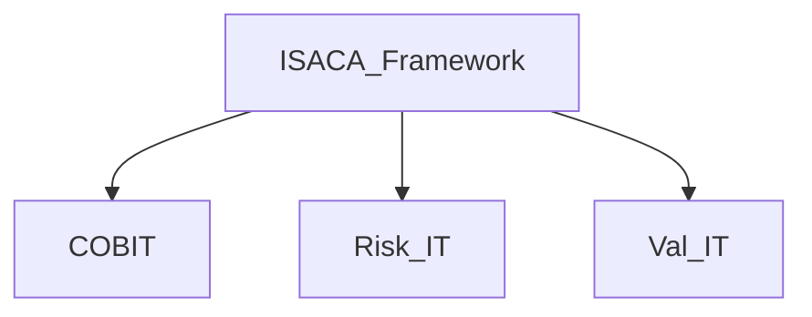

> [!info]
> Global nonprofit association
> Well-known in cybersecurity:
> - Frameworks
> - Certifications
> - Community engagement

# COBIT framework

- Developed by ISACA
- Tool for cyber auditors
- Manages IT systems and governance
- Evaluates the organization's ability to manage IT risks
- Ensures strategic and value-added IT investments

--> **IT governance**
--> **Framework structure**
--> **Risk management**
--> **Resource optimizations**
--> **Process improvement**

*NOTE: Governance is about making decisions. setting goals, and tracking progress,while Management is about implementing those decisions*
# Risk IT framework

- Developed by ISACA
- Aligns IT risk management
- Focuses on IT risk management
- Provides structured methodology
- Helps make efficient decisions
- Improves business processes

--> **Identify risks**
--> **Evaluate identified risks**
--> **Determine appropriate actions**
--> **Communicate and consult risks**
--> **Monitor and review risk actions**
--> **Manage IT systems and information**

# Val IT framework

- Generates values for IT investments
- Evaluates cybersecurity investments

--> **Investment management**
--> **Portfolio management**
--> **Resource management**
--> **Performance management**
--> **Risk management**

