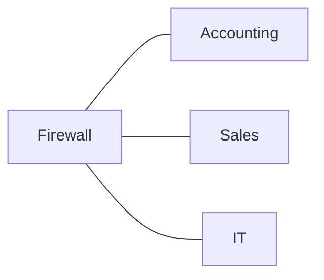
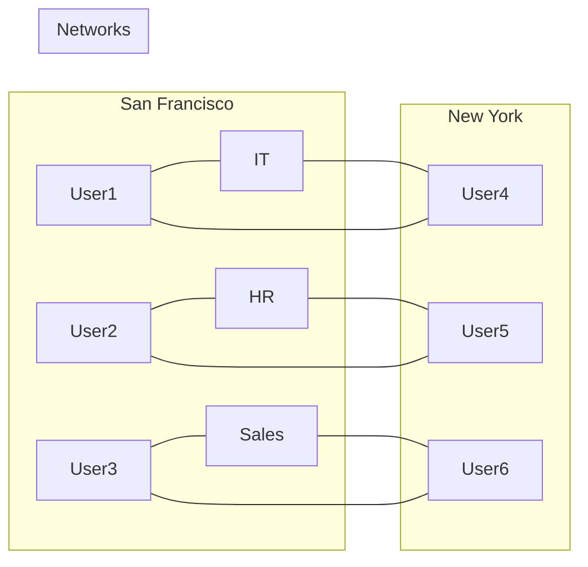

# VLAN

Virtual LANs separate systems on a network into logical groups based upon function, regardless of pysical location
Switches cary VLANs on a network

## Typical Network Diagram

## Network Border Firewall

--> VLANs extend the broadcast domain
--> *Users on the same VLAN will be able to contact each other as if they were connected to the same switch*

## Configuring VLANs

- Enable VLAN trunking
- Assign switch ports to VLANs
