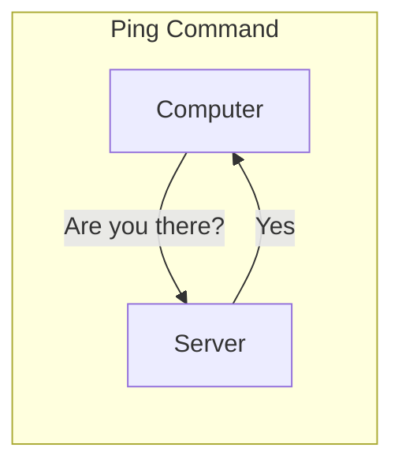
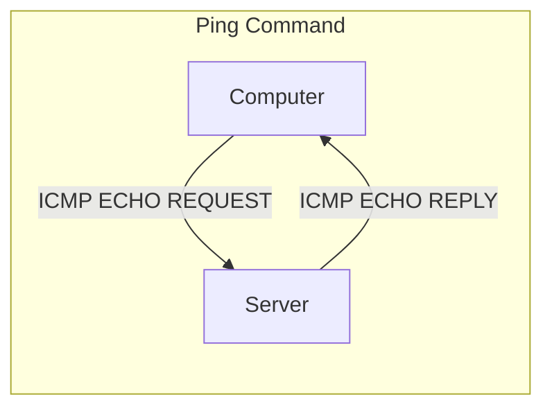

>[!info] Internet Control Message Protocol (ICMP)
>Housekeeping protocol of the internet
>Good for troubleshooting

### TOOLS: 

#### `ping`

^58aa21

Identifies live systems using the ICMP protocol

#### `traceroute`

^b25427

Identifies network paths

`-I` flag to use ICMP protocol

### Other ICMP Functions

- Destination unreachable
- Redirects
- Time exceeded
- Address mask requests and replies