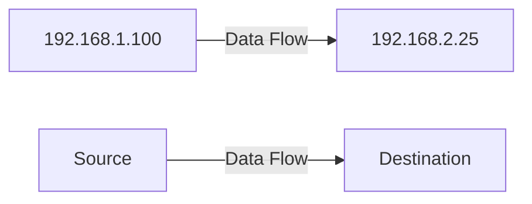

# IP addresses
*like street addresses*
- Uniquely identifies systems on a network
- Must not be reused on internet-connecte dsystems
- May be reused if on private networks --> Router or firewall translates those addresses to public IP addresses ([[Cyberminds Academy/Week 1/Cybersecurity Architecture/Module 3/Network Security/Firewalls#^3d958c|NAT]] protocol)

**Dotted Quad Notation**: 192.168.1.100 (each number: 0-255)
- 8-bit binary numbers
- $2^8=256$ possible values 
- Start counting at 0 --> 0-255 (256 values)

#### Subnets

^97008b

## **192.168**.*1.100*

**Network         *Host*
Address      *Address**

## **192**.*168.1.100*

**Network    *Host*
Address  *Address**

## **192.168.1.***100*

**Network           *Host*
Address         *Address**

Network address --> identifies the network the system is connected to (e.g. company)
Host address --> identifies the specific system connected to that network

#### Source and Destination

#### IPv6
- Replaces IPv4 due to address exhaustion
- **128 bits** (compared to 32 bits for IPv4)
- **Eight groups of four hexadecimal numbers**
e.g. *fd02:24c1:b942:01f3:ead2:123a:c3d2:cf1f*

> [!info] Static IPs
> Are manually assigned to systems by an adminsitrator. They must be unique and within the appropiate range for the network
> --> Servers are configured with static IPs

>[!info] Dynamic Host Configuration Protocol (DHCP)
>Allows the automatic assignment of IP addresses from an administrator-configured pool
>--> End-users are configured with dynamically changing IP addresses

