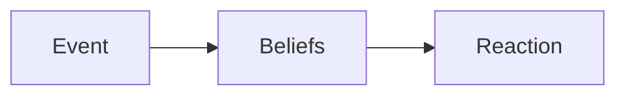

Epstein:
*'High-achievers succeed not despite of their carrer tangents but **because of them**'*

--> Linkedin-course: Developing self-awareness
# Understanding yourself

**ABC** model
**A**ctivate Event: objectively what happened
**B**eliefs: What made you think
**C**onsequence: how did you react

# Key Drivers for Motivation

**Mastery** --> become an expert
**Autonomy** --> freely make decisions
**Purpose** --> rewarding goal

**Blind Spot:** Mismatch between intention and perception
*You are in control of the impression you **intend** to make but you cannot control the **impact** you make in others*
Understand how others perceive you

**Kaizen**: continous improvement
Kai -> change
Zen -> good

SELF-AWARENESS
--> **Review how you come across**
--> **Refine your approach with others**
--> **Repeat the process**