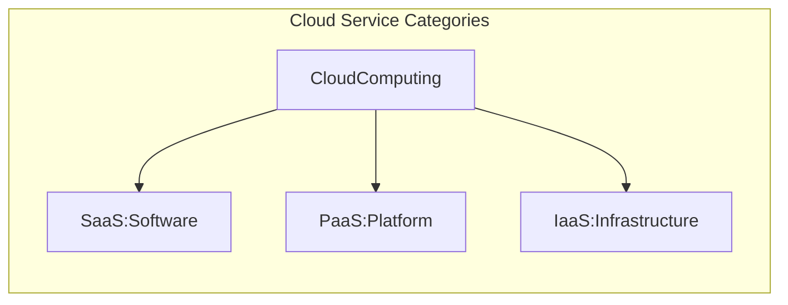

#### XaaS
Anything as a service

#### Software as a Service (SaaS)
Customer purchases an entire app
- Public cloud provider deliver an entire application
- Customer do not worry about storage, networking, or any details
- Normally accessed by web browsers
- SaaS solutions may be highly specialized, such as credit card processing software
#### Infrastructure as a Service (IaaS)
Customer purchases servers/storage
- Vendors: AWS, Azure, Google Platform
#### Platform as a Service (Paas)
Customer purchases app platform
#### Function as a Service (FaaS)
Also known as serverless computing

> [!important]
> Understanding the shared responsibility matrix is crucial for cybersecurity professionals

